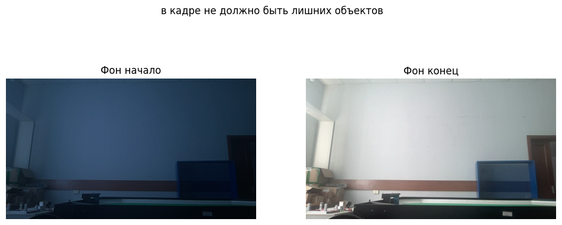
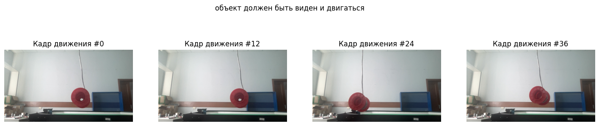
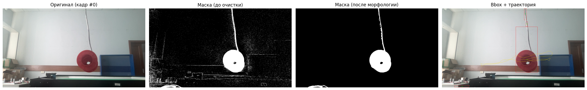

Костин Арсений, 8Е21, вариант 3.

Для 1 лаб работы по CV необходимо реализовать базовый минимум операций над изображениями
Входное изображение в формате (RGB, не чёрно-белое)
1. Фильтры
<br>1.1 Медианный фильтр
<br>1.2 Фильтр гаусса
2. Морфологические операции
<br>2.1 Эрозия
<br>2.2 Дилатация
3. Прочие операции
<br>3.1 пороговая бинаризация (для rgb и grayscale изображения)
<br>3.2 выравнивание гистограммы
<br>3.3 поворот изображений на угол кратный 90 градусов


Использовать методы OpenCV для реализации операций нельзя. Допустимы только методы cv2.imread() и cv2.imshow(). Все методы должны быть реализованы вручную.


```python
import numpy as np
import cv2
import matplotlib
import matplotlib.pyplot as plt
import random
#from PIL import Image
from IPython.display import Image
%matplotlib inline
import math

import os
print(os.getcwd())
```

    /home/ars/cv-labs-sem8/lab1


```python
image1=cv2.imread('sample_image.jpg')
image2=cv2.imread('sample_image2.png')
image3=cv2.imread('sample_image3.png')
```


```python
plt.imshow(image1)
```


    <matplotlib.image.AxesImage at 0x758be9a048c0>


    

    


```python
image1_RGB = cv2.cvtColor(image1, cv2.COLOR_BGR2RGB)
```


```python
plt.imshow(image1_RGB)
```


    <matplotlib.image.AxesImage at 0x758c3c6d89b0>


    

    


```python
print(image1_RGB)
```

# 1. ФИЛЬТРЫ

### 1.1 Медианный фильтр

Медианный фильтр - один из методов борьбы с "шумами". Суть заключается в том, что создается "окно" для проверки. Внутри окна элементы упорядочиваются по возрастанию/убыванию. Как медианное значение берется число в середине этого окна. Если таких чисел несколько, то берется среднее значение двух чисел посередине окна. Если рассмотреть одномерный массив как объект, к котрому будет применен фильтр:
(Используя пример из википедии: https://ru.wikipedia.org/wiki/%D0%9C%D0%B5%D0%B4%D0%B8%D0%B0%D0%BD%D0%BD%D1%8B%D0%B9_%D1%84%D0%B8%D0%BB%D1%8C%D1%82%D1%80)
<p>
Пусть есть одномерный массив x = [2 80 6 3]
Пусть окно проверки будет размером 3, обозначено круглыми скобками

1 итерация: (2 80 6)
упорядочить
(2 6 80) = медианное значение 6 = выход итерации = 6

2 итерация: (80 6 3)
упорядочить
(3 6 80) = медианное значение 6 = выход итерации 6

Алогритм выполнен, выход фильтра [6 6], потеряны 2 элемента. Тренд сохраняется и при других размерах "окна". Таким образом: (длина окна - 1)/2 = количество потерянных элементов с одного края. То есть, в нашем случае были потеряны первый и последний элементы исходного массива. Продублируем элементы. Получаем:
[2 2 80 6 3 3]
Применим к исправленному исходному массиву медианный фильтр

1 итерация: (2 2 80)
упорядочить
(2 2 80) = медианное значение 2 = выход итерации = 2

2 итерация: (2 80 6)
упорядочить
(2 6 80) = медианное значение 6 = выход итерации = 6

3 итерация: (80 6 3)
упорядочить
(3 6 80) = медианное значение 6 = выход итерации = 6

4 итерация: (6 3 3)
упорядочить
(3 3 6) = медианное значение 3 = выход итерации = 3

Выход функции [2 6 6 3]. Значения были существенно сглажены.

Стоит упомянуть, что размер окна так же может быть четным. Но даже в одномерных массивах возникают определенные трудности по его применению. Например, можно брать левое медианное значение в окне, можно брать правое, существует путь с применением среднего арифметического обоих чисел и округленное для целого числа. Для проверки алгоритмических способностей фильтра в текущей задаче это будет избыточно. </p>


```python
def median_1d(arr_initial, aperture):
    if aperture % 2 != 0:
        if aperture != 1:
            arr = [arr_initial[0]] + arr_initial + [arr_initial[-1]]
        else:
            arr = arr_initial
        curr_start = 0
        result = []
        for i in range(len(arr) - (aperture - 1)):
            curr_slice = arr[i : (aperture - 1 + i)+1]
            curr_slice = sorted(curr_slice)
            print(curr_slice)
            result.append(curr_slice[aperture // 2])
        return result
            
    else:
        print("Используйте окно нечетного размера")
        
print(median_1d([1,2,3,4,5], 3))

#random_arr = [6, 2, 4, 1, 2, 6, 9, 3, 1, 7] - 8 times for 3el window; 10 elements
#random_arr_ext = [6, 6, 2, 4, 1, 2, 6, 9, 3, 1, 7, 7] - 10 times for 3el window; 12 elements


# aperture 3 = ind 1
# aperture 5 = ind 2
# aperture 7 = ind 3
```

Проверим на примере из википедии


```python
print(median_1d([2,80,6,3], 3))
```

Результат совпал. Проверим при окне размером 1.


```python
print(median_1d([2,80,6,3], 1))
```

<p>
Смысла делать с окном ноль нет, не берется медианы.
<p>
Рассмотрим двумерный массив.
<p>
По сути алгоритм тот же, но в двумерном пространстве.
<p>
Берем окно квадратного размера, по сути матрицу меньшего порядка, чем изначальную. При этом рекомендация брать нечетную размерность аргументируется схожим образом как для одномерных массивов. Проходим этим окном по изображению. На каждой итерации разворачиваем текущий минор в ряд и применяем медианный фильтр. После этого заменяем центральный элемент минора на медианное значение от всех элеемнтов внутри этого минора - то есть, стоящее по середине отсортированного ряда.
<p>
Зададим матрицу:


```python
sample_matrix = []
for i in range(100):
    temp_row = []
    for j in range(100):
        temp_row.append(random.randint(1,100))
    sample_matrix.append(temp_row)
for i in sample_matrix:
    print(i)
```

Первый минор, размер 3:


```python
sample_matrix = np.array(sample_matrix)
minor_size = 3
sample_matrix_minor = sample_matrix[0:minor_size, 0:minor_size]
for i in sample_matrix_minor:
    print(i)
```

    [ 3 41 84]
    [67 92 88]
    [20 21 41]


Развернем и возьмем медианное значение


```python
unfolded_minor = np.reshape(sample_matrix_minor, (1,minor_size**2))
print(unfolded_minor)
print("Сортируем")
print(np.sort(unfolded_minor))
median_value = int(np.median(unfolded_minor))
print("Медианное значение =", median_value)
    
```

    [[ 3 41 84 67 92 88 20 21 41]]
    Сортируем
    [[ 3 20 21 41 41 67 84 88 92]]
    Медианное значение = 41


Присвоим центральному элементу минора его же медианное значение


```python
sample_matrix_minor[(minor_size//2)][(minor_size//2)] = median_value
print(minor_size//2)
for i in sample_matrix_minor:
    print(i)
```

    1
    [ 3 41 84]
    [67 41 88]
    [20 21 41]


Отлично, все работает. Теперь попробуем применить фильтр ко всей этой матрице:


```python
sample_matrix_median = sample_matrix.copy()
sample_matrix_median = np.pad(sample_matrix_median, (minor_size-1)//2)
for rows in range (sample_matrix.shape[1] - minor_size + 1):
    for columns in range(sample_matrix.shape[0] - minor_size + 1):
        
        current_minor = sample_matrix[rows:rows+minor_size, columns:columns+minor_size]
        print(current_minor)
        
        current_minor = np.reshape(current_minor, (1,current_minor.shape[0]**2))
        current_minor = np.sort(current_minor)
        print(current_minor)
        
        median_value = int(np.median(current_minor))
        print(median_value)
        
        sample_matrix_median[rows + minor_size//2][columns + minor_size//2] = median_value
for i in sample_matrix_median:
    print(i)
```


```python
f, axarr = plt.subplots(1,2)
axarr[0].imshow(sample_matrix, cmap='gray')
axarr[0].set_title('Исходная матрица')

axarr[1].imshow(sample_matrix_median, cmap='gray')
axarr[1].set_title('После медианного фильтра')
```


    Text(0.5, 1.0, 'После медианного фильтра')


    

    


```python
f, axarr = plt.subplots(1,2)
axarr[0].imshow(sample_matrix)
axarr[0].set_title('Исходная матрица')

axarr[1].imshow(sample_matrix_median)
axarr[1].set_title('После медианного фильтра')
```


    Text(0.5, 1.0, 'После медианного фильтра')


    

    


Медианный фильтр применен. Попробуем на изображении. Поскольку входное изображение имеет цвета, его можно представить как матрицу, где кол-во строк = высота изображения, кол-во столбцов = ширина, и каждый пиксель является одномерным массивом из трех элементов = интенсивность red, green, blue соотвественно. Получается 3-х ранговый тензор. Поскольку мы применяем фильтр сейчас к двумерному массиву, нам нужно преобразовать изображение в карту интенсивностей. То есть, мы потеряем цвет, но получим карту интенсивностей изображения в градациях серого. Самый простой способ - взять сумму всех интенсивностей по каналам и разделить на количество каналов.
<p>
Попробуем:

Изначальное изображение


```python
plt.imshow(image1_RGB)
```


    <matplotlib.image.AxesImage at 0x758be7476600>


    

    


```python
height, width, _ = image1_RGB.shape
image1_RGB_intensity = np.zeros((height, width), dtype='uint8')
print(image1_RGB.shape)
for rows in range(image1_RGB.shape[0]):
    for columns in range(image1_RGB.shape[1]):
        image1_RGB_intensity[rows][columns] = sum(image1_RGB[rows][columns]) // 3
plt.imshow(image1_RGB_intensity, cmap='gray')
print(image1_RGB_intensity)
```

    (741, 1153, 3)


    /tmp/ipykernel_5855/4285366573.py:6: RuntimeWarning: overflow encountered in scalar add
      image1_RGB_intensity[rows][columns] = sum(image1_RGB[rows][columns]) // 3


    

    


Теперь соберем это все в медианный фильтр для двумерного массива:


```python
def median_2d(image, minor_size = 3):
    if minor_size % 2 == 0:
        print("Выбрана четная размерность апертуры")
        return image
    else:
        image_median = image.copy()
        for rows in range (image.shape[0] - minor_size + 1):
            for columns in range(image.shape[1] - minor_size + 1):
                current_minor = image[rows:rows+minor_size, columns:columns+minor_size]
                #print(current_minor)
        
                current_minor = np.reshape(current_minor, (1,current_minor.shape[0]**2))
                current_minor = np.sort(current_minor)
                #print(current_minor)
        
                median_value = int(np.median(current_minor))
                #print(median_value)
        
                image_median[rows + minor_size//2][columns + minor_size//2] = median_value
        
        return image_median

#print(image1_RGB_intensity)
image = image1_RGB_intensity

#plt.imshow(image)
#image_median = median_2d(image)

# plt.imshow(image)
# plt.imshow(image_median)

#plt.figure(figsize=(40,40))
f, axarr = plt.subplots(1,2, figsize = (12,6))
axarr[0].imshow(image, cmap='gray')
axarr[0].set_title('Исходная матрица')

axarr[1].imshow(median_2d(image, 13), cmap='gray')
axarr[1].set_title('После медианного фильтра')
    
```


    Text(0.5, 1.0, 'После медианного фильтра')


    

    


Последнее - завернем перевод в карту интенсивностей в функцию


```python
def intensity(image):
    height, width, _ = image.shape
    image_intensity = np.zeros((height, width), dtype='uint8')

    for rows in range(image.shape[0]):
        for columns in range(image.shape[1]):
            image_intensity[rows][columns] = sum(image[rows][columns]) // 3

    return image_intensity

image = image2

f, axarr = plt.subplots(1,2, figsize = (12,6))
image = cv2.cvtColor(image, cv2.COLOR_BGR2RGB)
axarr[0].imshow(image)
axarr[0].set_title('Исходная матрица')

axarr[1].imshow(intensity(image), cmap = 'gray')
axarr[1].set_title('Карта инстенсивностей')
```

    /tmp/ipykernel_5855/713769101.py:7: RuntimeWarning: overflow encountered in scalar add
      image_intensity[rows][columns] = sum(image[rows][columns]) // 3


    Text(0.5, 1.0, 'Карта инстенсивностей')


    

    


Посмотрим на результаты применения медианного фильтра к изображению 2


```python
image = intensity(image2)

f, axarr = plt.subplots(1,2, figsize = (12,6))
axarr[0].imshow(image, cmap='gray')
axarr[0].set_title('Исходная матрица')

axarr[1].imshow(median_2d(image, 13), cmap='gray')
axarr[1].set_title('После медианного фильтра')
```

    /tmp/ipykernel_5855/713769101.py:7: RuntimeWarning: overflow encountered in scalar add
      image_intensity[rows][columns] = sum(image[rows][columns]) // 3


    Text(0.5, 1.0, 'После медианного фильтра')


    

    


```python
f, axarr = plt.subplots(1,2, figsize = (12,6))
axarr[0].imshow(image, cmap='gray')
axarr[0].set_title('Исходная матрица')

axarr[1].imshow(median_2d(image, 13), cmap='gray')
axarr[1].set_title('После медианного фильтра')
```


    Text(0.5, 1.0, 'После медианного фильтра')


    

    


А что насчет цветных изображений, как поступить там? наша функция работает же лишь для 2х мерных массивов. Решить эту проблему можно применим медианный фильтр для каждого из каналов отдельно. Рассмотрим изображение 3:


```python
image3_RGB = cv2.cvtColor(image3, cv2.COLOR_BGR2RGB) #изначально opencv видит как BGR, переведем в RGB
plt.imshow(image3_RGB)
```


    <matplotlib.image.AxesImage at 0x758be6e4b4d0>


    

    


```python
height, width, _ = image3_RGB.shape
image3_R, image3_G, image3_B = np.split(image3_RGB, 3, axis=2)

image3_R_median = median_2d(image3_R, 13)
image3_G_median = median_2d(image3_G, 13)
image3_B_median = median_2d(image3_B, 13)
image3_R_median.shape

image3_RGB_median = np.dstack((image3_R_median, image3_G_median, image3_B_median))
plt.imshow(image3_RGB_median)
```


    <matplotlib.image.AxesImage at 0x758be6edd100>


    

    


Получилось! Сравним:


```python
image = image3_RGB
image1 = image3_RGB_median
f, axarr = plt.subplots(1,2, figsize = (12,6))
axarr[0].imshow(image)
axarr[0].set_title('Исходная матрица')

axarr[1].imshow(image1)
axarr[1].set_title('После медианного фильтра')

```


    Text(0.5, 1.0, 'После медианного фильтра')


    

    


Фоформиим как функцию:


```python
def median_2d_RGB(image, minor_size = 3):
    if minor_size % 2 == 0:
        print("Выбрана четная размерность апертуры")
        return image
    else:
        if len(image.shape) == 2:
            return median_2d(image, minor_size)

        elif len(image.shape) == 3 and image.shape[2] == 3:
            height, width, _ = image.shape
            image_R, image_G, image_B = np.split(image, 3, axis=2)

            image_R_median = median_2d(image3_R, 13)
            image_G_median = median_2d(image3_G, 13)
            image_B_median = median_2d(image3_B, 13)

            image_RGB_median = np.dstack((image_R_median, image_G_median, image_B_median))
            return image_RGB_median
        else:
            print("Изображение не RGB, должно быть 3 цветовых канала")

image = image3_RGB
image1 = image3_RGB_median
plt.imshow(median_2d_RGB(image3_RGB, 13))
```


    <matplotlib.image.AxesImage at 0x758be6c22960>


    

    


```python
image = image3_RGB
image1 = image3_RGB_median
image2 = median_2d_RGB(image1, 39)
```


```python
f, axarr = plt.subplots(1,3, figsize = (15,9))
axarr[0].imshow(image)
axarr[0].set_title('Исходная матрица')

axarr[1].imshow(image1)
axarr[1].set_title('После медианного фильтра')

axarr[2].imshow(image2)
axarr[2].set_title('Результат фильтра после медианного фильтра')
```


    Text(0.5, 1.0, 'Результат фильтра после медианного фильтра')


    

    


Поскольку значения на изображении остались теми же, фильтровать повторно там нечего. Соответственно, результаты 2 и 3 абсолютно идентичны.

### 1.2 Фильтр гаусса

По определению: Размытие по Гауссу в цифровой обработке изображений — способ размытия изображения с помощью функции Гаусса, названной в честь немецкого математика Карла Фридриха Гаусса.

Этот эффект широко используется в графических редакторах для уменьшения шума изображения и снижения детализации. Визуальный эффект этого способа размытия напоминает эффект просмотра изображения через полупрозрачный экран, и отчётливо отличается от эффекта боке, создаваемого расфокусированным объективом или тенью объекта при обычном освещении. 

Математика: Поскольку преобразование Фурье функции Гаусса само является функцией Гаусса, применение размытия по Гауссу приводит к уменьшению высокочастотных компонентов изображения. Таким образом, размытие по Гауссу является фильтром нижних частот. 
В этом способе размытия функция Гаусса (которая также используется для описания нормального распределения в теории вероятностей) используется для вычисления преобразования, применяемого к каждому пикселю изображения. Формула функции Гаусса в одном измерении: 


```python
img = cv2.imread('./gaussfunc.png')
plt.imshow(img)
```


    <matplotlib.image.AxesImage at 0x758be6bf5610>


    

    


Сигма в этой функции это среднеквадратическое отклонение нормального распределения. Визуализируем в desmos.


```python
img = Image('./output.gif')
img
```


    <IPython.core.display.Image object>


В двухмерном пространстве по определению это произведение двух функций Гаусса, для каждого измерения. Зададим функцию Гаусса как функцию в коде:


```python
def Gauss(x, sigma):
    return (1/math.sqrt(2*math.pi*(sigma**2)))*(math.e**(-(x**2)/(2*(sigma**2))))

print(Gauss(0, 0.7))
```

    0.5699175434306182


Визуализируем


```python
x_values = np.arange(-3, 3, 0.01)

sigma = 0.7
y_values = [Gauss(x, sigma) for x in x_values]

plt.figure(figsize=(10, 6))
plt.plot(x_values, y_values, linewidth=1)
plt.grid(True)
plt.xlabel('x')
plt.ylabel('G(x)')
plt.title('Функция Гаусса')
plt.show()
```


    

    


Попробуем задать второе измерение и визуализировать


```python
x_values = np.arange(-3, 3, 0.01)
y_values = np.arange(-3, 3, 0.01)
X, Y = np.meshgrid(x_values, y_values)
sigma = 0.7

Z = np.zeros_like(X)
print(Z.shape)
for i in range(len(x_values)):
    for j in range(len(y_values)):
        Z[j, i] = Gauss(X[j, i], sigma) * Gauss(Y[j, i], sigma)

plt.figure(figsize=(10, 6))

plt.subplot(1, 2, 1)
contour = plt.contourf(X, Y, Z, levels=50, cmap='gray')
plt.colorbar(contour)
plt.xlabel('x')
plt.ylabel('y')
plt.title('Двумерная функция Гаусса (произведение)')
plt.axis('equal')

ax = plt.subplot(1, 2, 2, projection='3d')
surf = ax.plot_surface(X, Y, Z, cmap='gray')
ax.set_xlabel('x')
ax.set_ylabel('y')
ax.set_zlabel('G(x,y)')

plt.tight_layout()
plt.show()
```

    (600, 600)


    

    


Как видим, образуется своебразный колокол. Интенсивность в центре выше. В этом строится основная идея применения фильтра. Если мы представим изображение, по которому будем проходиться апертурой, то станет ясно что то, что окажется в ее центре имеет больший вес. А то что к краям - там значение меньше, важность меньше. Соответственно, поэтому фильтр Гаусса является фильтром низких частот. Практически это значит, что если есть изображения с маленькими шумами, то фильтр их должен убрать, попробуем:


```python
import numpy as np
import matplotlib.pyplot as plt

def gauss_kernel_visualize(sigma, minor_size=3):
    #АХТУНГ! По сути тот выйдет на выходе кернел 200 на 200 - почему? смотри коммент ниже
    if minor_size % 2 == 0:
        print("Выбрана четная размерность апертуры")
        return None

    c = minor_size // 2
    x_values = np.linspace(-c, c, 200)
    '''
    Зачем здесь такая громоздкая хреновина и что делает? Мы задаем x_values на 200 точек от -с до +с значениями.
    Почему? потому что при маленьком количестве точек, получается, что функция для визуализации contourf.
    Она работает строя изолинии по интерполяциий между узлами сетки. А у нас она выходит с шагом в 1 по хорошему.
    (так как минор небольшой, там не будет 200 элементов по одной оси... Обычно 9 или 21 берут. То бишь раз в 10 меньше)
    Как быть? в целях визуализации моя апертура будет 200 на 200 элементов. Все красиво, работает.
    А если хочу визуализировать в натуральном размере? Не вопрос, делай, но ты выведешь ромб, а не круг...
    При маленьких расстояниях интерполяция начинает себя вести не как евклидово расстояние, а манхэттенское - лесенкой.
    Собственно ты и получаешь не круг, а круг из майнкрафта - ромб.
    Если горит визуализировать как круг - надо искать альтернативный способ. На момент написания мне лень это делать,
    это не является целью реализации метода. Но если мне станет не лень, напишу ниже.
    Так что же такое X,Y которые я швыряю в Z. Изображение к которому применят функцию гаусса? нет! Это координатная сетка
    для финальной визуализации, вот и все!
    '''
    y_values = np.linspace(-c, c, 200)
    X, Y = np.meshgrid(x_values, y_values)

    Z = Gauss(X, sigma) * Gauss(Y, sigma)
    Z /= Z.sum()  # нормализация
    return X, Y, Z

minor_size = 3
X, Y, Z = gauss_kernel_visualize(0.7, minor_size)

plt.figure(figsize=(10, 6))
contour = plt.contourf(X, Y, Z, levels=50, cmap='gray')
plt.colorbar(contour)
plt.xlabel('x')
plt.ylabel('y')
plt.title('Двумерная функция Гаусса (произведение)')
plt.axis('equal')
plt.show()
print(Z.shape)

```


    

    


    (200, 200)


```python
def gaussian_2d(image, sigma, minor_size = 9):
    if minor_size % 2 == 0:
        print("Выбрана четная размерность апертуры")
        return image
    else:
        image_gaussian = image.astype(float).copy()
        pad = minor_size // 2
        image_padded = np.pad(image, pad, mode='edge') #исправим ошибку с потерей краев изображений при применении фильтров добавив паддинг, см. визуализацию медианного фильтра, если непонятно.
        
        x_values = np.arange(-pad, pad+1, 1)
        y_values = np.arange(-pad, pad+1, 1)
        X, Y = np.meshgrid(x_values, y_values)

        Z = np.ones_like(X, dtype=float)
        print('limits for Z kernel', np.min(Z), np.max(Z))
        for i in range(len(x_values)):
            for j in range(len(y_values)):
                Z[j, i] = Gauss(X[j, i], sigma) * Gauss(Y[j, i], sigma)
        Z /= Z.sum() #нормализуем. зачем? потому что в сумме все должно единичку дать. не будет этого - будут приколы с избыточной/недостаточной интенсивностью. можно отключить и проверить результат...
        print('limits for Z kernel after normalization', np.min(Z), np.max(Z))
        for rows in range (image_padded.shape[0] - minor_size + 1):
            for columns in range(image_padded.shape[1] - minor_size + 1):

                current_minor = image_padded[rows:rows+minor_size, columns:columns+minor_size]
                accumulator = 0
                
                accumulator = np.sum(current_minor * Z)
                
                image_gaussian[rows][columns] = accumulator
        
        print('limits for gaussian output', np.min(image_gaussian), np.max(image_gaussian))
        return image_gaussian #почему не обрезал паддинг который добавляли? потому что он у меня при свертке только для чтения был. перезапись пикселей сделана только в копии исходного изображения, собственно, размеры и не поменялись...
    

#plt.imshow(gaussian_2d(image1_RGB_intensity, 0.7, 3), cmap='gray')

```


```python
f, axarr = plt.subplots(1,2, figsize = (12,6))
axarr[0].imshow(image1_RGB_intensity, cmap='gray')
axarr[0].set_title('Исходная матрица')

image1_RGB_intensity_gaussian = gaussian_2d(image1_RGB_intensity, 3.7, 121)
axarr[1].imshow(image1_RGB_intensity_gaussian, cmap='gray')
axarr[1].set_title('После фильтра Гаусса')

print(image1_RGB_intensity.shape, image1_RGB_intensity_gaussian.shape)
```

    limits for Z kernel 1.0 1.0
    limits for Z kernel after normalization 7.259019782378444e-117 0.011625634995755686
    limits for gaussian output 0.010995363459556876 82.94163571012916
    (741, 1153) (741, 1153)


    

    


Супер, все работает. А что делать с RGB? То же что и с медианным. Сделаем все ровно то же самое, просто по каналам.


```python
def gaussian_2d_RGB(image, sigma, minor_size = 9):
    if minor_size % 2 == 0:
        print("Выбрана четная размерность апертуры")
        return image
    else:
        if len(image.shape) == 2:
            return gaussian_2d(image, sigma, minor_size)

        elif len(image.shape) == 3 and image.shape[2] == 3:
            height, width, _ = image.shape
            image_R, image_G, image_B = np.split(image, 3, axis=2)
            image_R = image_R.squeeze()
            image_G = image_G.squeeze()
            image_B = image_B.squeeze()

            image_R_gaussian = gaussian_2d(image_R, sigma, minor_size)
            print('limits for R channel', np.min(image_R_gaussian), np.max(image_R_gaussian))
            image_G_gaussian = gaussian_2d(image_G, sigma, minor_size)
            print('limits for G channel', np.min(image_G_gaussian), np.max(image_G_gaussian))
            image_B_gaussian = gaussian_2d(image_B, sigma, minor_size)
            print('limits for B channel', np.min(image_B_gaussian), np.max(image_B_gaussian))

            image_RGB_gaussian = np.dstack((image_R_gaussian, image_G_gaussian, image_B_gaussian))
            image_RGB_gaussian = np.clip(image_RGB_gaussian, 0, 255).astype(np.uint8)
            return image_RGB_gaussian
        else:
            print("Изображение не RGB, должно быть 3 цветовых канала")

```

Отлично, можно визуализировать:


```python
image = image3_RGB
image1 = gaussian_2d_RGB(image3_RGB, 3.7, 121)
f, axarr = plt.subplots(1,2, figsize = (12,6))
axarr[0].imshow(image)
axarr[0].set_title('Исходная матрица')

axarr[1].imshow(image1)
axarr[1].set_title('После фильтра Гаусса')
```


    Text(0.5, 1.0, 'После фильтра Гаусса')


    

    


# 2. Морфологические операции

По опредению: Морфология является широким набором операций обработки изображений, которые процесс отображает на основе форм. Морфологические операции применяют элемент структурирования к входному изображению, создавая выходное изображение, одного размера. В морфологической операции значение каждого пикселя в выходном изображении основано на сравнении соответствующего пикселя во входном изображении с его соседями. Источник: https://docs.exponenta.ru/images/morphological-dilation-and-erosion.html


### 2.1 Эрозия

Значение выходного пикселя является минимальным значением всех пикселей в окружении. В бинарном изображении пиксель установлен в 0 если какой-либо из соседних пикселей имеет значение 0.

Морфологическая эрозия удаляет острова и маленькие объекты так, чтобы только независимые объекты остались.

То есть, мы смотрим на соседей в окрестности апертуры относительно таргета - целевого пикселя. Если хоть один выполняет условие - таргет приобретает значение из условия. Импортируем новое изображение для этой главы:


```python
image4 = cv2.imread('sample_image4.jpg')
image4 = cv2.cvtColor(image4, cv2.COLOR_BGR2RGB)
plt.imshow(image4)
```


    <matplotlib.image.AxesImage at 0x758bf6eb2960>


    

    


Так же, как и раньше для простоты переведем в чернобелое изображений исходник. В этот раз я захотел использовать не карту инстенсивности, а реальный перевод в черно-белый формат с полутонами. По сути, та же карта интенсивности. Только в этот раз мы не просто будем усреднять значения по каналам, а использовать корректную фотограмметрическую формулу для такого перевода: Result = 0.299 R + 0.587 G + 0.114 B


```python
def intensity_grayscale(image):
    height, width, _ = image.shape
    image_intensity = np.zeros((height, width), dtype='uint8')

    for rows in range(image.shape[0]):
        for columns in range(image.shape[1]):
            #отталкиваемся от того, что исходник RGB и порядок каналов сохранен
            image_intensity[rows][columns] = 0.299*image[rows][columns][0] + 0.587*image[rows][columns][1] + 0.114*image[rows][columns][2]

    return image_intensity

```


```python
image = image4
image4_gray = intensity_grayscale(image)
```


```python
f, axarr = plt.subplots(1,2, figsize = (12,6))
axarr[0].imshow(image)
axarr[0].set_title('Исходная матрица')

axarr[1].imshow(image4_gray, cmap='gray')
axarr[1].set_title('После перевода')
```


    Text(0.5, 1.0, 'После перевода')


    

    


```python
print(image4_gray.dtype)
```

    uint8


Теперь можем приступать к тому же алгоритму! У нас будет кернел - апертура, в окрестности которой мы будем сравнивать пиксели. Как проходить мы знаем, как добавлять паддинг для избежания потери краев изображения при свертке знаем. Принципиально один вопрос - как сравнивать. Наше изображение, как показано выше, закодировано в формате uint8. То бишь, глубина цвета 8 бит. Unsigned = нет знака. Соответственно максимум у нас каждый цвет кодируется 8 битами, а не 7. Значит значение интенсивности цвета лежит в промежутке от 0 до 2^8. 0...255. Где 256 - его нет, так как отчет мы ведем с нуля.

Отлично, мы будем сравнивать значения пикселей под апертурой в диапазоне от 0 до 255. Соответственно, нужно то, с чем мы будем сравнивать, условие. Для этих целей вводим понятие - порог, threshold. Пускай этот порог будет иметь некоторое значение. Например, 122. Значит то, что будет в окрестности апертуры ниже или равно получит логически ноль. Если такие пиксели в окрестности есть - такое значение получит и таргет. Все что больше - на результат не повлияет.

Стоит отметить, что та же логика будет применена к главе 2.2. Но в обратную сторону. То есть если больше или равно условию/порогу - повлияет на таргет. Это будет рассмотрено в следующей главе. 

Приступим к реализации:


```python
def eroded_threshold(image, threshold, minor_size = 9):
    if minor_size % 2 == 0:
        print("Выбрана четная размерность апертуры")
        return image
    else:
        image_eroded = image.astype(float).copy()
        pad = minor_size // 2
        image_padded = np.pad(image, pad, mode='edge') #исправим ошибку с потерей краев изображений при применении фильтров добавив паддинг, см. визуализацию медианного фильтра, если непонятно.
        
        # x_values = np.arange(-pad, pad+1, 1)
        # y_values = np.arange(-pad, pad+1, 1)
        # X, Y = np.meshgrid(x_values, y_values)

        # Z = np.ones_like(X, dtype=float)
        # print('limits for Z kernel', np.min(Z), np.max(Z))
        
        for rows in range (image_padded.shape[0] - minor_size + 1):
            for columns in range(image_padded.shape[1] - minor_size + 1):
                current_minor = image_padded[rows:rows+minor_size, columns:columns+minor_size]
                for i in current_minor:
                    for j in i:
                        if j <= threshold:
                            image_eroded[rows][columns] = threshold #а если соседей подходящих на условие несколько, мы будем несколько раз присваивать значение таргету? Да. Не хочется - можно ввести переменную для флага и тогда все равно его переопределять несколько раз. Смысл?
        
        print('limits for eroded output', np.min(image_eroded), np.max(image_eroded))
        return image_eroded #почему не обрезал паддинг который добавляли? потому что он у меня при свертке только для чтения был. перезапись пикселей сделана только в копии исходного изображения, собственно, размеры и не поменялись...
    

#plt.imshow(gaussian_2d(image1_RGB_intensity, 0.7, 3), cmap='gray')

```


```python
image = image4_gray
image = cv2.resize(image, (image.shape[1] // 4, image.shape[0] // 4), 
                         interpolation=cv2.INTER_AREA) #зачем? исходное было очень большое, программа долго выполнялась. Хотите без потери времени работать с большими - делайте многопоток и кидайте PR, вообще капитальными красавчиками будете!

image4_gray_eroded = eroded_threshold(image, 42, 3)

```

    limits for eroded output 42.0 254.0


```python
f, axarr = plt.subplots(1,2, figsize = (12,6))
axarr[0].imshow(image, cmap='gray')
axarr[0].set_title('Исходная матрица')

axarr[1].imshow(image4_gray_eroded, cmap='gray')
axarr[1].set_title('После перевода')
```


    Text(0.5, 1.0, 'После перевода')


    

    


Отлично! Как мы видим, при текущих параметрах, тонкие паутинки стали пропадать. При этом сам паук остался. Попробуем вообще избавиться от паутинок:


```python
image = image4_gray
image = cv2.resize(image, (image.shape[1] // 4, image.shape[0] // 4), 
                         interpolation=cv2.INTER_AREA) #зачем? исходное было очень большое, программа долго выполнялась. Хотите без потери времени работать с большими - делайте многопоток и кидайте PR, вообще капитальными красавчиками будете!

image4_gray_eroded = eroded_threshold(image, 68, 3)

f, axarr = plt.subplots(1,2, figsize = (12,6))
axarr[0].imshow(image, cmap='gray')
axarr[0].set_title('Исходная матрица')

axarr[1].imshow(image4_gray_eroded, cmap='gray')
axarr[1].set_title('После перевода')
```

    limits for eroded output 68.0 254.0


    Text(0.5, 1.0, 'После перевода')


    

    


Получилось! Теперьв центре мы в состоянии выденить лишь самого паука, без паутины. То есть логика простая. Маленькие штуки - фильтруются. Чем тоньше цель - тем легче ее "съесть", проверяя то насколько она тонкая засчет соседей. Соотвественно размер апертуры - насколько хирургически мы действуем. А порог - таргет с которым мы сравниваем. Попробуем обратную операцию, расширение/диляция/дилатация.

P.S. А как обстоят дела с RGB? Так же как с прошлыми. Но там мы применяем эту операцию отдельно к каждому из каналов. 
Кстати, эрозия так же активно применяется к бинаризованным изображениям. О них упомянуто в главе 3.1. Посколько там порог задается и применяется на этапе бинаризации, функция эрозии или диляции уже не потребует задания какого либо порога. Там либо 0 у соседей ищем, либо 1 соответственно.

### 2.2 Дилатация a.k.a Диляция, Расширение


Значение выходного пикселя является максимальным значением всех пикселей в окружении. В бинарном изображении пиксель установлен в 1 если какой-либо из соседних пикселей имеет значение 1.

Морфологическое расширение делает объекты более видимыми и заполняет маленькие отверстия в объектах.

Используем прошлый код функции и перевернем логику. Гипотеза - паутинки должны стать толще. Пробуем:


```python
def dilated_threshold(image, threshold, minor_size = 9):
    if minor_size % 2 == 0:
        print("Выбрана четная размерность апертуры")
        return image
    else:
        image_dilated = image.astype(float).copy()
        pad = minor_size // 2
        image_padded = np.pad(image, pad, mode='edge') #исправим ошибку с потерей краев изображений при применении фильтров добавив паддинг, см. визуализацию медианного фильтра, если непонятно.
        
        for rows in range (image_padded.shape[0] - minor_size + 1):
            for columns in range(image_padded.shape[1] - minor_size + 1):
                current_minor = image_padded[rows:rows+minor_size, columns:columns+minor_size]
                for i in current_minor:
                    for j in i:
                        if j >= threshold:
                            image_dilated[rows][columns] = threshold #а если соседей подходящих на условие несколько, мы будем несколько раз присваивать значение таргету? Да. Не хочется - можно ввести переменную для флага и тогда все равно его переопределять несколько раз. Смысл?
        
        print('limits for dilated output', np.min(image_dilated), np.max(image_dilated))
        return image_dilated #почему не обрезал паддинг который добавляли? потому что он у меня при свертке только для чтения был. перезапись пикселей сделана только в копии исходного изображения, собственно, размеры и не поменялись...
    

```


```python
image = image4_gray
image = cv2.resize(image, (image.shape[1] // 4, image.shape[0] // 4), 
                         interpolation=cv2.INTER_AREA) #зачем? исходное было очень большое, программа долго выполнялась. Хотите без потери времени работать с большими - делайте многопоток и кидайте PR, вообще капитальными красавчиками будете!

image4_gray_dilated = dilated_threshold(image, 122, 3)

f, axarr = plt.subplots(1,2, figsize = (12,6))
axarr[0].imshow(image, cmap='gray')
axarr[0].set_title('Исходная матрица')

axarr[1].imshow(image4_gray_dilated, cmap='gray')
axarr[1].set_title('После перевода')
```

    limits for dilated output 0.0 122.0


    Text(0.5, 1.0, 'После перевода')


    

    


Выводы те же самые с проправкой на то, что операция обратная. Гипотеза верна, ч.т.д.

Ради эксперимента в главе 3.1. применим диляцию к бинаризованному изображению для наглядности.

# 3. Прочие операции

### 3.1 Пороговая бинаризация (для rgb и grayscale изображения)

По определению:
Процесс бинаризации – это перевод цветного (или в градациях серого) изображения в двухцветное черно-белое. Главным параметром такого преобразования является порог t – значение, с которым сравнивается яркость каждого пикселя. По результатам сравнения, пикселю присваивается значение 0 или 1. Существуют различные методы бинаризации, которые можно условно разделить на две группы – глобальные и локальные. В первом случае величина порога остается неизменной в течение всего процесса бинаризации. Во втором изображение разбивается на области, в каждой из которых вычисляется локальный порог.
Источник: https://habr.com/ru/articles/278435/

То есть, есть некоторый порог с которым мы сравниваем каждый пиксель изображения. Наш случай - первый, глобальный, простой. Меньше порога - присваиваем пикселю ноль, больше порога - единицу. Стоит отметить сразу, что для RGB логика та же, просто отдельно по каналам мы проверяем попиксельно интенсивности. 

Начнем импортируя новое изображение и выделяя интересующую нас область:


```python
image5 = cv2.imread('sample_image5.jpg')
image5 = cv2.cvtColor(image5, cv2.COLOR_BGR2RGB)
plt.imshow(image5)
```


    <matplotlib.image.AxesImage at 0x758beac59940>


    

    


```python
image5_gray = intensity_grayscale(image5)
image5_gray_cropped = image5_gray[300:600, 200:600]

plt.imshow(image5_gray_cropped, cmap='gray')
plt.show()
```


    

    


Супер! Теперь попробуем пройтись по изображению с порогом в 125. Реализуем функцию:


```python
def binarized(image, threshold):
    image1 = image.copy()
    
    for rows in range (image1.shape[0]):
            for columns in range(image1.shape[1]):
                if image1[rows][columns] <= threshold:
                    image1[rows][columns] = 0
                else:
                    image1[rows][columns] = 1

    return image1
```


```python
image = image5_gray_cropped
image_binarized = binarized(image, 125)

f, axarr = plt.subplots(1,2, figsize = (12,6))
axarr[0].imshow(image, cmap='gray')
axarr[0].set_title('Исходная матрица')

axarr[1].imshow(image_binarized, cmap='gray')
axarr[1].set_title('После перевода')
```


    Text(0.5, 1.0, 'После перевода')


    

    


Как видим, то что было светлее 125 стало единицей - белым - неважным. То, что было равно или темнее 125 стало выразительным. Отдельные элементы лица, с которыми нам, возможно, пришлось бы работать стали отдельными и их отделить от остального изображения станет легче.

Как обещал, попробуем избавиться от неточностей при помощи морфологических операций. Внимание на нос - я хочу оставить ноздрю ии попробовать избавиться от остальных ненужных частей. Применим эрозию:

Для этого поменяем функцию эрозии для бинаризованных изображений:


```python
def eroded_bin(image, minor_size = 3):
    if minor_size % 2 == 0:
        print("Выбрана четная размерность апертуры")
        return image
    else:
        image_eroded = image.astype(float).copy()
        pad = minor_size // 2
        image_padded = np.pad(image, pad, mode='edge') #исправим ошибку с потерей краев изображений при применении фильтров добавив паддинг, см. визуализацию медианного фильтра, если непонятно.

        for rows in range (image_padded.shape[0] - minor_size + 1):
            for columns in range(image_padded.shape[1] - minor_size + 1):
                current_minor = image_padded[rows:rows+minor_size, columns:columns+minor_size]
                for i in current_minor:
                    for j in i:
                        if j == 1:
                            image_eroded[rows][columns] = 1 #а если соседей подходящих на условие несколько, мы будем несколько раз присваивать значение таргету? Да. Не хочется - можно ввести переменную для флага и тогда все равно его переопределять несколько раз. Смысл?
        
        print('limits for eroded output', np.min(image_eroded), np.max(image_eroded))
        return image_eroded #почему не обрезал паддинг который добавляли? потому что он у меня при свертке только для чтения был. перезапись пикселей сделана только в копии исходного изображения, собственно, размеры и не поменялись...

```


```python
image_binarized_eroded = eroded_bin(image_binarized, 5)

f, axarr = plt.subplots(1,2, figsize = (12,6))
axarr[0].imshow(image_binarized, cmap='gray')
axarr[0].set_title('Исходная матрица')

axarr[1].imshow(image_binarized_eroded, cmap='gray')
axarr[1].set_title('После перевода')
```

    limits for eroded output 0.0 1.0


    Text(0.5, 1.0, 'После перевода')


    

    


Получилось! Но мы слишком сильно избавились от частей носа. Наш таргет - ноздря тоже пострадала. Попробуем применить диляцию:


```python
def dilated_bin(image, minor_size = 3):
    if minor_size % 2 == 0:
        print("Выбрана четная размерность апертуры")
        return image
    else:
        image_dilated = image.astype(float).copy()
        pad = minor_size // 2
        image_padded = np.pad(image, pad, mode='edge') #исправим ошибку с потерей краев изображений при применении фильтров добавив паддинг, см. визуализацию медианного фильтра, если непонятно.

        for rows in range (image_padded.shape[0] - minor_size + 1):
            for columns in range(image_padded.shape[1] - minor_size + 1):
                current_minor = image_padded[rows:rows+minor_size, columns:columns+minor_size]
                for i in current_minor:
                    for j in i:
                        if j == 0:
                            image_dilated[rows][columns] = 0 #а если соседей подходящих на условие несколько, мы будем несколько раз присваивать значение таргету? Да. Не хочется - можно ввести переменную для флага и тогда все равно его переопределять несколько раз. Смысл?
        
        print('limits for eroded output', np.min(image_dilated), np.max(image_dilated))
        return image_dilated #почему не обрезал паддинг который добавляли? потому что он у меня при свертке только для чтения был. перезапись пикселей сделана только в копии исходного изображения, собственно, размеры и не поменялись...

```


```python
image_binarized_eroded_dilated = dilated_bin(image_binarized_eroded, 3)

f, axarr = plt.subplots(1,2, figsize = (12,6))
axarr[0].imshow(image_binarized_eroded, cmap='gray')
axarr[0].set_title('Исходная матрица')

axarr[1].imshow(image_binarized_eroded_dilated, cmap='gray')
axarr[1].set_title('После перевода')
```

    limits for eroded output 0.0 1.0


    Text(0.5, 1.0, 'После перевода')


    

    


Отлично. Ноздря на месте и мы значительно избавились от лишних деталей. Вернемся к RGB:

Попробуем сделать так же, но для RGB. Пускай для каждого канала мы зададим отдельно свой порог

Определим для этого функцию:


```python
def binarized_RGB(image, thresholdR, thresholdG, thresholdB):
    image1 = image.copy()
    if len(image1.shape) == 2:
        print("Используй функцию binarized, эта функция нужна для RGB, а здесь больше 1 канала")
    else:
        image_R, image_G, image_B = np.split(image1, 3, axis=2)
        image_R = image_R.squeeze()
        image_G = image_G.squeeze()
        image_B = image_B.squeeze()
        image_R_binarized = binarized(image_R, thresholdR)
        image_G_binarized = binarized(image_G, thresholdG)
        image_B_binarized = binarized(image_B, thresholdB)
        image_RGB_binarized = np.dstack((image_R_binarized, image_G_binarized, image_B_binarized))
        #image_RGB_gaussian = np.clip(image_RGB_gaussian, 0, 255).astype(np.uint8)
        return image_RGB_binarized

```


```python
image5_binarized_RGB = binarized_RGB(image5, 125, 125, 125)
print(image5_binarized_RGB.shape)

image_R, image_G, image_B = np.split(image5_binarized_RGB, 3, axis=2)
image_R = image_R.squeeze()
image_G = image_G.squeeze()
image_B = image_B.squeeze()

f, axarr = plt.subplots(1,2, figsize = (12,6))
axarr[0].imshow(image5)
axarr[0].set_title('Исходная матрица')

image5_binarized_RGB_display = (image5_binarized_RGB * 255).astype(np.uint8) # нормализуем в диапазон 0...255 для RGB отображения
axarr[1].imshow(image5_binarized_RGB_display)
# axarr[1].imshow(image_R, cmap='gray')
axarr[1].set_title('После перевода')
```

    (1200, 1200, 3)


    Text(0.5, 1.0, 'После перевода')


    

    


### 3.2 Выравнивание гистограммы

По определению:
Операция выравнивания гистограмм (увеличение контраста) часто используется для увеличения качества изображения.
Гистограмма представляет из себя функцию h(x), которая возвращает суммарное количество пикселей, яркость которых равна x.

Гистограмма h полутонового изображения I задается выражением:


```python
img = cv2.imread('./histfunc.png')
plt.imshow(img)
```


    <matplotlib.image.AxesImage at 0x758be64b3a40>


    

    


, где m соответствует интервалам значений яркости

Визуально гистограмма представляет из себя прямоугольник, ширина которого равна максимально возможному значению яркости точки на исходном изображении. Для полутоновых изображений мы будем работать с диапазоном яркостей точек от 0 до 255, а значит и ширина гистограммы будет равна 256. Высота гистограммы может быть любой, но для наглядности мы будем работать с прямоугольными гистограммами.

С точки зрения программиста, гистограмма — это одномерный массив размерностью 256 (в нашем случае), где каждый элемент массива хранит в себе суммарное количество точек соответствующей яркостью. 

Надо визуализировать. Сначала попробуем вывести гистограмму изображения:


```python
def image_hist(image):
    counts = dict.fromkeys(range(256), 0)
    
    for rows in range (image.shape[0]):
            for columns in range(image.shape[1]):
                counts[image[rows][columns]] += 1
    return counts

image = image4_gray
print(np.min(image), np.max(image))
counts = image_hist(image)

names = list(counts.keys())
values = list(counts.values())
    
plt.bar(names, values)
plt.show()
```

    0 255


    

    


Видно, что функция распределения распределена не равномерно.

В начале стабильные значения. Примерно вторую четверть графика она близка в нулю (относительно вертикальной координаты), потом идет небольшой рост и в последней четверти графика все спокойно за исключением конца, там опять резкий рост. Процедура выравнивания гистограммы заключается в том, чтобы сделать функцию распределения более равномерной, чтобы она возрастала примерно одинаково во всем своем диапазоне.

Посчитаем PDF(вероятности) для каждой интенсивности. Напоминаю, что у нас 256 интенсивностей, а промежуток значений от 0 до 255.


```python
image = image4_gray
counts = image_hist(image)
total_pixels = image.shape[0]*image.shape[1]

names = list(counts.keys())
values = list(counts.values())
probabilities = list()

for i in names:
    temp = counts[i]/total_pixels
    probabilities.append(counts[i]/total_pixels)

names = list(counts.keys())
values = probabilities
    
plt.bar(names, values)
plt.show()


```


    

    


Теперь считаем кумулятиву (CDF)


```python
cdf = [0] * 256
cumulative = 0.0

for i in range(256):
    cumulative += probabilities[i]
    cdf[i] = cumulative

names = list(counts.keys())
values = cdf
    
plt.bar(names, values)
plt.show()

```


    

    


Все по теории, все отлично, финальная кумулятива = 1. Теперь попробуем выравнять. То есть пиксель с интенсивностью умножаем на соответствующую этой интенсивности кумулятиву.


```python
image_equalized = np.zeros_like(image)

for rows in range(image.shape[0]):
    for columns in range(image.shape[1]):
        r = image[rows][columns]
        s = int(round(cdf[r] * 255)) #зачем округление? у нас интенсивности - целые числа, а не дробные. А кумулятивы дробные.
        image_equalized[rows][columns] = s

f, axarr = plt.subplots(1,2, figsize = (12,6))
axarr[0].imshow(image, cmap='gray')
axarr[0].set_title('Исходная матрица')

image_hist_equalized = image_equalized
#image_hist_equalized = (image_hist_equalized * 255).astype(np.uint8) # нормализуем в диапазон 0...255 для RGB отображения
axarr[1].imshow(image_hist_equalized, cmap='gray')
# axarr[1].imshow(image_R, cmap='gray')
axarr[1].set_title('После перевода')
```


    Text(0.5, 1.0, 'После перевода')


    

    


как видим, изображение было чересчур темным, а стало достаточно сбланасированно ярким. Посмотрим на гистограммы:


```python
counts = image_hist(image)
total_pixels = image.shape[0]*image.shape[1]

names = list(counts.keys())
values = list(counts.values())

names = list(counts.keys())
values = list(counts.values())
    
plt.bar(names, values)
plt.show()
```


    

    


```python
image = image_hist_equalized
counts = image_hist(image)
total_pixels = image.shape[0]*image.shape[1]

names = list(counts.keys())
values = list(counts.values())

names = list(counts.keys())
values = list(counts.values())
    
plt.bar(names, values)
plt.show()
```


    

    


Как видно, цель выполнена, гистограмма стала значительно равнее. Попробуем на RGB:


```python
def hist_equalize(image):
    counts = dict.fromkeys(range(256), 0)
    
    for rows in range (image.shape[0]):
            for columns in range(image.shape[1]):
                counts[image[rows][columns]] += 1

    total_pixels = image.shape[0]*image.shape[1]

    probabilities = list()

    for i in names:
        temp = counts[i]/total_pixels
        probabilities.append(counts[i]/total_pixels)
        

    cdf = [0] * 256
    cumulative = 0.0

    for i in range(256):
        cumulative += probabilities[i]
        cdf[i] = cumulative

    image_equalized = np.zeros_like(image)

    for rows in range(image.shape[0]):
        for columns in range(image.shape[1]):
            r = image[rows][columns]
            s = int(round(cdf[r] * 255)) #зачем округление? у нас интенсивности - целые числа, а не дробные. А кумулятивы дробные.
            image_equalized[rows][columns] = s
            
    return image_equalized

```


```python
def hist_equalize_RGB(image):
    image1 = image.copy()
    image_R, image_G, image_B = np.split(image1, 3, axis=2)
    image_R = image_R.squeeze()
    image_G = image_G.squeeze()
    image_B = image_B.squeeze()
    image_R_equalized = hist_equalize(image_R)
    image_G_equalized = hist_equalize(image_G)
    image_B_equalized = hist_equalize(image_B)
    image_RGB_equalized = np.dstack((image_R_equalized, image_G_equalized, image_B_equalized))
    image_RGB_equalized = np.clip(image_RGB_equalized, 0, 255).astype(np.uint8)
    return image_RGB_equalized
```


```python
image = image4
image_hist_equalized = hist_equalize_RGB(image)
f, axarr = plt.subplots(1,2, figsize = (12,6))
axarr[0].imshow(image)
axarr[0].set_title('Исходная матрица')

axarr[1].imshow(image_hist_equalized)
axarr[1].set_title('После перевода')
```


    Text(0.5, 1.0, 'После перевода')


    

    


### 3.3 поворот изображений на угол кратный 90 градусов

Что такое поворот? По своей сути это смена рядов и столбцов исходной матрицы местами. То есть, транспонирование в каком то смысле. Давайте попробуем...


```python
plt.imshow(image4_gray, cmap='gray')
```


    <matplotlib.image.AxesImage at 0x758be5be9730>


    

    


```python
image4_gray_transposed = np.transpose(image4_gray)
plt.imshow(image4_gray_transposed, cmap='gray')
```


    <matplotlib.image.AxesImage at 0x758be5773320>


    

    


Получилось! Мы повернули картинку на -90 градусов. Попробуем повращать дальше:


```python
image4_gray_transposed = np.transpose(image4_gray_transposed)
plt.imshow(image4_gray_transposed, cmap='gray')
```


    <matplotlib.image.AxesImage at 0x758be6455220>


    

    


Не вышло. Функция транспонирования реверсивна. Если ее применить повторно, то ряды и столбцы просто поменяются местами обратно. Как быть?

Вообще, подсказка кроется в первом результате транспонирования. Если бы паучок смотрел в противоположную сторону, то это был бы поворот на +90 градусов, то есть, по часовой. Попробуем еще раз:


```python
image4_gray_transposed = np.transpose(image4_gray)
for rows in range(len(image4_gray_transposed)):
    curr_row = image4_gray_transposed[rows]
    rev_row = curr_row[::-1]
    image4_gray_transposed[rows] = rev_row
    
plt.imshow(image4_gray_transposed, cmap='gray')
```


    <matplotlib.image.AxesImage at 0x758be5635490>


    

    


Что-то пошло не так... изображение отзеркалено по горизонтали. Паучок должен был смотреть наверх. Получается, мы перепутали порядок операций. Надо было разворачивать ряды, а мы развернули "столбцы" изначального изображения, потому что работали над транспонированным. попробуем изменить порядок действий и провести проверку:


```python
image = intensity_grayscale(image4)

image_90_ccw = image.copy()
image_90_cw = image.copy()

image_90_ccw = np.transpose(image_90_ccw)
#plt.imshow(image_90_ccw, cmap='gray')

for rows in range(len(image_90_cw)):
    curr_row = image_90_cw[rows]
    rev_row = curr_row[::-1]
    image_90_cw[rows] = rev_row

image_90_cw = np.transpose(image4_gray)
    
#plt.imshow(image_90_cw, cmap='gray')
```


```python
f, axarr = plt.subplots(1,3, figsize = (12,6))

axarr[0].imshow(image, cmap='gray')
axarr[0].set_title('изначально')

axarr[1].imshow(image_90_cw, cmap='gray')
axarr[1].set_title('по часовой')

axarr[2].imshow(image_90_ccw, cmap='gray')
axarr[2].set_title('против часовой')
```


    Text(0.5, 1.0, 'против часовой')


    

    


Супер, получилось! Получается, применив реверс рядов и транспонируя результат мы вращаем результат на 90 градусов по часовой стрелке. Сколько раз это будет сделано можно задать целым числом - как параметр для этой функции. Оформим как функцию для grayscale. Для RGB так же, как и везде делается ровно то же самое, просто по каждому из каналов...


```python
def rotate_90_cw(image, amount):
    image_90_cw = image.copy()

    for i in range(amount):
        image_90_cw = np.transpose(image_90_cw)
        
        for rows in range(len(image_90_cw)):
            curr_row = image_90_cw[rows]
            rev_row = curr_row[::-1]
            image_90_cw[rows] = rev_row
    
    return image_90_cw

image = image5_gray
plt.imshow(image, cmap='gray')
    
```


    <matplotlib.image.AxesImage at 0x758be58f7ef0>


    

    


```python
plt.imshow(rotate_90_cw(image, 4), cmap='gray')
```


    <matplotlib.image.AxesImage at 0x758be55e1610>


    

    


```python
plt.imshow(rotate_90_cw(image, 3), cmap='gray')
```


    <matplotlib.image.AxesImage at 0x758be5450e00>


    

    


```python
plt.imshow(rotate_90_cw(image, 2), cmap='gray')
```


    <matplotlib.image.AxesImage at 0x758be54fba10>


    

    


```python
def rotate_90_cw_rgb(image, amount):
    image1 = image.copy()
    image_R, image_G, image_B = np.split(image1, 3, axis=2)
    image_R = image_R.squeeze()
    image_G = image_G.squeeze()
    image_B = image_B.squeeze()
    image_R_rotated = rotate_90_cw(image_R, amount)
    image_G_rotated = rotate_90_cw(image_G, amount)
    image_B_rotated = rotate_90_cw(image_B, amount)
    image_RGB_rotated = np.dstack((image_R_rotated, image_G_rotated, image_B_rotated))
    image_RGB_rotated = np.clip(image_RGB_rotated, 0, 255).astype(np.uint8)
    return image_RGB_rotated

image = image5
f, axarr = plt.subplots(1,3, figsize = (12,6))

axarr[0].imshow(image)
axarr[0].set_title('изначально')

axarr[1].imshow(rotate_90_cw_rgb(image, 1))
axarr[1].set_title('по часовой 1 раз')

axarr[2].imshow(rotate_90_cw_rgb(image, 2))
axarr[2].set_title('вверх ногами')
```


    Text(0.5, 1.0, 'вверх ногами')


    

    


# Вывод

Все получилось. Кто сдох - тот лох. Кто дочитал - красавчик. Передохни и иди читай вторую лабу.

Костин Арсений, 8Е21, вариант 3.

Лабораторная работа №2. Визуальная одометрия (навигация)
Цель: Разработать систему визуальной одометрии (навигации) по группе фотографий.
Ход работы: сделайте не менее 8 фото с переносом камеры или ноутбука по квадрату (то есть двиньте сначала вправо, потом вперед, потом влево, потом назад и обратно в начальную точку). Используя данные фотографии реализуйте следующее:
<p> 1.	Определите на каждой фотографии ключевые точки </p>
<p>2.	Отфильтруйте самые наилучшие применяю адаптивный радиус и локальные максимумы, не забудьте так же выровнять по яркости изображения.</p>
<p>3.	Постройте по каждой точке дескриптор (можете использовать любой, рекомендуется SIFT)</p>
<p>4.	Сопоставьте два соседних изображения на предмет соответствия ключевых точек. То есть определите пары одинаковых точек.</p>
<p>5.	Постройте модель преобразования изображений, учитывайте только поворот и сдвиг.</p>
<p>6.	С учетом полученных моделей постройте траекторию движения камеры.</p>
<p>Проверка работоспособности: будет осуществляться на специальной группе фото, предоставленных преподавателем. Траектория движения, для которых недоступна.</p>
<p>В процессе выполнения вы можете использовать готовые функции по погрузке данных, перевода в цветовые пространства, фильтрации, для построения прямых и траекторий. Функции 1-6 описанные выше должны быть реализованы самостоятельно.</p>


```python
import numpy as np
import cv2
import matplotlib
import matplotlib.pyplot as plt
import random
#from PIL import Image
from IPython.display import Image
%matplotlib inline
import math
import lab1_functions as lb1
import os
print(os.getcwd())
print(os.listdir())
```

    /home/ars/cv-labs-sem8/lab1
    ['sequence5.jpeg', 'lab1_functions.py', 'sample_image2.png', 'lab2.py', 'sequence4.jpeg', '__pycache__', 'doodles.ipynb', 'lab1.py', 'lab1.ipynb', 'sequence6.jpeg', 'sample_image3.png', 'sequence8.jpeg', 'sample_image.jpg', 'histfunc.png', 'gpt-stripfunctions.py', 'sequence3.jpeg', 'sample_image4.jpg', 'output.gif', 'sequence7.jpeg', 'sample_image5.jpg', 'gaussfunc.png', 'sequence1.jpeg', 'gradient.png', 'harris1.png', 'sequence2.jpeg', 'lab2.ipynb']


# 2.1 Загрузить изображения

Приступим, импортируем сделанные изображения:


```python
image1=cv2.cvtColor(cv2.imread('sequence1.jpeg'), cv2.COLOR_BGR2RGB)
image2=cv2.cvtColor(cv2.imread('sequence2.jpeg'), cv2.COLOR_BGR2RGB)
image3=cv2.cvtColor(cv2.imread('sequence3.jpeg'), cv2.COLOR_BGR2RGB)
image4=cv2.cvtColor(cv2.imread('sequence4.jpeg'), cv2.COLOR_BGR2RGB)
image5=cv2.cvtColor(cv2.imread('sequence5.jpeg'), cv2.COLOR_BGR2RGB)
image6=cv2.cvtColor(cv2.imread('sequence6.jpeg'), cv2.COLOR_BGR2RGB)
image7=cv2.cvtColor(cv2.imread('sequence7.jpeg'), cv2.COLOR_BGR2RGB)
image8=cv2.cvtColor(cv2.imread('sequence8.jpeg'), cv2.COLOR_BGR2RGB)

images_sequence = [image1, image2, image3, image4, image5, image6, image7, image8]

f, axarr = plt.subplots(2,4, figsize = (12,6))

axarr[0,0].imshow(image1)
axarr[0,1].imshow(image2)
axarr[0,2].imshow(image3)
axarr[0,3].imshow(image4)

axarr[1,0].imshow(image5)
axarr[1,1].imshow(image6)
axarr[1,2].imshow(image7)
axarr[1,3].imshow(image8)
```


    <matplotlib.image.AxesImage at 0x78ddea78b230>


    

    


Лирическое отступление - чтобы не размазывать отчет, работа будет вестись над grayscale изображениями. То что мы будем использовать - не зависит от цветов, как видно из первой лабы. Все что возможно - можно сделать для RGB повторяя те же операций и преобразования, просто трижды - по разу для каждого цветового канала. Это не цель лабораторной работы. Приступим, переведем изображения в черно-белый формат, используя функцию из прошлой лабы.


```python
images_sequence_gray = []
for img in images_sequence:
    images_sequence_gray.append(lb1.intensity_grayscale(img))
```


```python
f, axarr = plt.subplots(2,4, figsize = (12,6))

axarr[0,0].imshow(images_sequence_gray[0], cmap='gray')
axarr[0,1].imshow(images_sequence_gray[1], cmap='gray')
axarr[0,2].imshow(images_sequence_gray[2], cmap='gray')
axarr[0,3].imshow(images_sequence_gray[3], cmap='gray')

axarr[1,0].imshow(images_sequence_gray[4], cmap='gray')
axarr[1,1].imshow(images_sequence_gray[5], cmap='gray')
axarr[1,2].imshow(images_sequence_gray[6], cmap='gray')
axarr[1,3].imshow(images_sequence_gray[7], cmap='gray')
```


    <matplotlib.image.AxesImage at 0x78ddd93675f0>


    

    


То есть, нам нужно:

загрузить изображения, привести их к одинаковой яркости / grayscale, найти ключевые точки, отфильтровать точки, построить дескрипторы (SIFT), сопоставить точки между соседними кадрами, вычислить преобразование (поворот + сдвиг), накопить преобразования и построить траекторию камеры

Исправим проблемы с яркостью, применив реализованный модуль для выравнивания гистограммы:

# 2.2 Привести к одинаковой яркости / grayscale

для нашего удобства и ментального здоровья зададим функцию готовую для отображения картинок из серии:


```python
def show_images(images_sequence, rows=2, cols=4, figsize=(12,6)):
    
    fig, axes = plt.subplots(rows, cols, figsize=figsize)
    axes = axes.flatten()

    for i, ax in enumerate(axes):
        if i < len(images_sequence):
            ax.imshow(images_sequence[i], cmap='gray')
            ax.axis('off')  # убираем оси
        else:
            ax.axis('off')  # если картинок меньше, оставляем пустые

    plt.tight_layout()
    plt.show()
```


```python
show_images(images_sequence_gray, 2, 4)
```


    

    


Супер. Вернемся к идее применить выравнивание гистограммы на всех изображениях:


```python
images_hist_equalized = images_sequence_gray
for img in images_hist_equalized:
    img = lb1.hist_equalize(img)
    
show_images(images_sequence_gray, 2, 4)
```


    

    


# 2.3 Найти ключевые точки

Приступаем. На изображениях у нас есть два магнита рядом, но нам могут значительно помешать: блики, тень от фотографа, другие нерелватные в этом контексте детали. Это визуальный <b>шум</b>. От шума надо избавиться, рассмотрим изображение 1, применим для подавления шумов фильтр Гаусса.


```python
images_temp = [images_hist_equalized[0], lb1.gaussian_2d(images_hist_equalized[0], 1.2, 21)]
show_images(images_temp, 1, 2)
```

    limits for Z kernel 1.0 1.0
    limits for Z kernel after normalization 7.658057422279819e-32 0.11052426603583844
    limits for gaussian output 2.4991448589236085 234.7124602763381


    

    


Стало слегка лучше. Теперь перейдем к теории:

Ключевые точки: это такие места, по которым сравнивая две картинки можно отследить движение.

Если бы мы смотрели на голубое небо и взяли его кусочек как ключевую точку, то распределение интенсивностей было бы +- одинаковое между ним и другим кусочком неба. Это плохая ключевая точка.

Если бы мы смотрели на фото прикроватной тумбочки, то могли бы предположить, что край тумбочки - хорошая ключевая точка, т.к. интенсивность прыгает на моменте перехода от края тумбочки к ее боковой части в тени. По идее - уже неплохо, но если двигаться вдоль этого края - ситуация не поменяется при сравнении двух кадров.

Из этого следует, что лучший вариант - когда меняются по двум направлениям тренды. Например, угол тумбочки. Вдоль него не подвигаться, то есть изменение интенсивности слева и спереди (перед стеной) достаточно легко отслеживаются.  

Из математики следует, что производная функции показывает скорость изменения ее значения. А градиент - вектор, показывающий <b>НАПРАВЛЕНИЕ</b> наибыстрейшего увеличения функции. Это то, что надо нам. Формула для градиента в общей форме выглядит так:


```python
img = cv2.imread('./gradient.png')
plt.imshow(img)
```


    <matplotlib.image.AxesImage at 0x78ddc7ffaa20>


    

    


Исходя из вышесказанного, понятно, что алгоритмы поиска ключевых точек ищут точки, где изменение яркости происходит во многих направлениях одновременно.

Математически - ищем градиенты изображения, по x и y координатам. 

Пусть I_x = изменение по х, I_y = изменение по y.
<p>Значит, место, где I_x = 0, I_y = 0 это однородная область.
<p>Если I_x большое, I_y маленькое = это край.
<p>Если I_x большое, I_y большое = это угол (ключевая точка).

Из опыта прошлой лабы мы понимаем, что смотреть на сам один пиксель недостаточно. Нужно брать апертуру/кернел/область/окно. Так и сделаем. Идейно по определению подходит фильтр Хариса. Источник: https://docs.exponenta.ru/R2021a/visionhdl/ug/corner-detection.html

### 2.3.1 Разберем этот фильтр

Фактически у нас есть исходное изображение, minor_size, k, threshold_ratio.

minor_size - так же как в прошлой лабе, размер апертуры/кернел/окно. маленькое окно = чувствительность к мелким деталям, большое окно = реагирует только на крупные структуры

источник: https://docs.opencv.org/3.4/dc/d0d/tutorial_py_features_harris.html
<p> k - коэффициент, испольуемый в формуле Хариса:


```python
img = cv2.imread('./harris1.png')
plt.imshow(img)
```


    <matplotlib.image.AxesImage at 0x78dda6851070>


    

    


Этот коэффициент регулирует насколько алгоритм строго смотрит края.
<p>Маленький = алгоритм более терпим к краям, может принимать некоторые края за углы
<p>Большой = алгоритм строгий, оставляет только очень выраженные углы

threshold_ratio

После вычисления Harris response R нужно решить какие точки считать ключевыми.

Для этого берётся максимум:
R_max = max(R)

и строится порог:

threshold = threshold_ratio * R_max

Если threshold_ratio = 0.01, то берутся точки у которых R > 1% от максимального

Если увеличить до 0.1 = останутся только самые сильные углы.


```python
def harris_keypoints(image, minor_size=5, k=0.04, threshold_ratio=0.01):

    if len(image.shape) == 3:
        image = intensity_grayscale(image)

    image = image.astype(float)

    height, width = image.shape

    Ix = np.zeros_like(image)
    Iy = np.zeros_like(image)

    # градиенты (центральные разности)
    for r in range(1, height-1):
        for c in range(1, width-1):
            Ix[r][c] = (image[r][c+1] - image[r][c-1]) / 2
            Iy[r][c] = (image[r+1][c] - image[r-1][c]) / 2

    pad = minor_size // 2

    R = np.zeros_like(image)

    for r in range(pad, height-pad):
        for c in range(pad, width-pad):

            sum_Ix2 = 0
            sum_Iy2 = 0
            sum_Ixy = 0

            for i in range(-pad, pad+1):
                for j in range(-pad, pad+1):
                    gx = Ix[r+i][c+j]
                    gy = Iy[r+i][c+j]

                    sum_Ix2 += gx*gx
                    sum_Iy2 += gy*gy
                    sum_Ixy += gx*gy

            det = sum_Ix2 * sum_Iy2 - sum_Ixy**2
            trace = sum_Ix2 + sum_Iy2

            R[r][c] = det - k*(trace**2)

    R_max = np.max(R)
    threshold = threshold_ratio * R_max

    keypoints = []

    for r in range(pad, height-pad):
        for c in range(pad, width-pad):

            if R[r][c] > threshold:

                local_max = True

                for i in range(-1,2):
                    for j in range(-1,2):
                        if R[r+i][c+j] > R[r][c]:
                            local_max = False

                if local_max:
                    keypoints.append((r,c))

    return keypoints, Ix, Iy
```

Что тут происходит? Сначала вычисляются упомянутые градиенты изображения.
Градиент показывает, насколько быстро меняется яркость:

Ix — изменение яркости по горизонтали

Iy — изменение яркости по вертикали

Это делается с помощью центральной разности: берётся разница между соседними пикселями.

После этого алгоритм начинает рассматривать каждую точку изображения и маленькое окно вокруг неё (minor_size). Внутри этого окна суммируются значения градиентов:

квадрат горизонтального градиента

квадрат вертикального градиента

произведение двух градиентов

Эти суммы используются для вычисления величины R. Она показывает, насколько вероятно, что точка является углом.

Дальше выбираются только точки, у которых R достаточно большое (больше порога).
После этого выполняется проверка локального максимума: точка должна быть больше всех своих соседей. Это нужно, чтобы оставить только самые сильные углы и убрать лишние точки вокруг них.

В итоге функция возвращает:

keypoints — координаты найденных углов

Ix — карту горизонтальных градиентов

Iy — карту вертикальных градиентов


```python
def draw_keypoints(image, keypoints, Ix=None, Iy=None, show_vectors=False, vector_scale=5):

    img = image.copy()

    if len(img.shape) == 2:
        img = np.dstack((img,img,img))

    plt.figure(figsize=(8,6))
    plt.imshow(img)

    for (r,c) in keypoints:
        plt.scatter(c, r, s=20)

        if show_vectors and Ix is not None and Iy is not None:
            gx = Ix[r][c]
            gy = Iy[r][c]

            plt.arrow(c, r,
                      gx*vector_scale,
                      gy*vector_scale,
                      head_width=3,
                      length_includes_head=True)

    plt.axis("off")
    plt.show()
    fig = plt.gcf()
    fig.canvas.draw()
    
    buf = fig.canvas.buffer_rgba()
    data = np.asarray(buf)
    data = data[:, :, :3]
    
    return data
```

Функция draw_keypoints рисует найденные ключевые точки на изображении. Сначала создаётся копия изображения. Если изображение чёрно-белое, оно превращается в трёхканальное (RGB), чтобы на нём можно было рисовать цветные элементы.


Для каждой найденной точки:

на изображении рисуется маркер (точка)

если включён параметр show_vectors, дополнительно рисуется стрелка

Стрелка показывает направление градиента в этой точке. Она берётся из Ix и Iy и показывает, в каком направлении яркость изменяется сильнее всего.

Параметр vector_scale просто увеличивает длину стрелок, чтобы их было лучше видно.


```python
gray = images_temp[1]

keypoints, Ix, Iy = harris_keypoints(gray, minor_size=9)

draw_keypoints(gray, keypoints)
```

    Clipping input data to the valid range for imshow with RGB data ([0..1] for floats or [0..255] for integers). Got range [2.4991448589236085..234.7124602763381].


    

    


    array([[[255, 255, 255],
            [255, 255, 255],
            [255, 255, 255],
            ...,
            [255, 255, 255],
            [255, 255, 255],
            [255, 255, 255]],
    
           [[255, 255, 255],
            [255, 255, 255],
            [255, 255, 255],
            ...,
            [255, 255, 255],
            [255, 255, 255],
            [255, 255, 255]],
    
           [[255, 255, 255],
            [255, 255, 255],
            [255, 255, 255],
            ...,
            [255, 255, 255],
            [255, 255, 255],
            [255, 255, 255]],
    
           ...,
    
           [[255, 255, 255],
            [255, 255, 255],
            [255, 255, 255],
            ...,
            [255, 255, 255],
            [255, 255, 255],
            [255, 255, 255]],
    
           [[255, 255, 255],
            [255, 255, 255],
            [255, 255, 255],
            ...,
            [255, 255, 255],
            [255, 255, 255],
            [255, 255, 255]],
    
           [[255, 255, 255],
            [255, 255, 255],
            [255, 255, 255],
            ...,
            [255, 255, 255],
            [255, 255, 255],
            [255, 255, 255]]], shape=(480, 640, 3), dtype=uint8)


    <Figure size 640x480 with 0 Axes>


Как видим, ключевые точки отлично отобразились. Но здесь, думаю, сыграло хорошее качество изображения и правильно подобранный наугад размер апертуры. Попробуем с более быстрым вариантом, с апертурой поменьше:


```python
gray = images_temp[1]

keypoints, Ix, Iy = harris_keypoints(gray, minor_size=3)

draw_keypoints(gray, keypoints)
```

    Clipping input data to the valid range for imshow with RGB data ([0..1] for floats or [0..255] for integers). Got range [2.4991448589236085..234.7124602763381].


    

    


    array([[[255, 255, 255],
            [255, 255, 255],
            [255, 255, 255],
            ...,
            [255, 255, 255],
            [255, 255, 255],
            [255, 255, 255]],
    
           [[255, 255, 255],
            [255, 255, 255],
            [255, 255, 255],
            ...,
            [255, 255, 255],
            [255, 255, 255],
            [255, 255, 255]],
    
           [[255, 255, 255],
            [255, 255, 255],
            [255, 255, 255],
            ...,
            [255, 255, 255],
            [255, 255, 255],
            [255, 255, 255]],
    
           ...,
    
           [[255, 255, 255],
            [255, 255, 255],
            [255, 255, 255],
            ...,
            [255, 255, 255],
            [255, 255, 255],
            [255, 255, 255]],
    
           [[255, 255, 255],
            [255, 255, 255],
            [255, 255, 255],
            ...,
            [255, 255, 255],
            [255, 255, 255],
            [255, 255, 255]],
    
           [[255, 255, 255],
            [255, 255, 255],
            [255, 255, 255],
            ...,
            [255, 255, 255],
            [255, 255, 255],
            [255, 255, 255]]], shape=(480, 640, 3), dtype=uint8)


    <Figure size 640x480 with 0 Axes>


Точек меньше, но очевидно ошибочной можно назвать лишь одну, сверху. Откуда она взялась? На изображении в этом месте блик от окна. Похоже, что это светлое пятно и было обнаружено. Для анализа была написана функция рисующая стрелки направлений для обнаруженных градиентов, посмотрим:


```python
draw_keypoints(gray, keypoints, Ix, Iy, show_vectors=True)
```

    Clipping input data to the valid range for imshow with RGB data ([0..1] for floats or [0..255] for integers). Got range [2.4991448589236085..234.7124602763381].


    

    


    array([[[255, 255, 255],
            [255, 255, 255],
            [255, 255, 255],
            ...,
            [255, 255, 255],
            [255, 255, 255],
            [255, 255, 255]],
    
           [[255, 255, 255],
            [255, 255, 255],
            [255, 255, 255],
            ...,
            [255, 255, 255],
            [255, 255, 255],
            [255, 255, 255]],
    
           [[255, 255, 255],
            [255, 255, 255],
            [255, 255, 255],
            ...,
            [255, 255, 255],
            [255, 255, 255],
            [255, 255, 255]],
    
           ...,
    
           [[255, 255, 255],
            [255, 255, 255],
            [255, 255, 255],
            ...,
            [255, 255, 255],
            [255, 255, 255],
            [255, 255, 255]],
    
           [[255, 255, 255],
            [255, 255, 255],
            [255, 255, 255],
            ...,
            [255, 255, 255],
            [255, 255, 255],
            [255, 255, 255]],
    
           [[255, 255, 255],
            [255, 255, 255],
            [255, 255, 255],
            ...,
            [255, 255, 255],
            [255, 255, 255],
            [255, 255, 255]]], shape=(480, 640, 3), dtype=uint8)


    <Figure size 640x480 with 0 Axes>


Интересно. Блик на самом деле левее. При ближайшем рассмотрении оказалось, что на холодильнике была точка с грязью. Она темная и поэтому была обнаружена. Получается, нам нужно быть готовым к ошибочным точкам и как то их фильтровать. Рассмотрим это в следующей части. А пока предлагаю для наглядности отобразить градиенты и сравнить с изначальным изображением.


```python
plt.figure(figsize=(12,4))

plt.subplot(1,3,1)
plt.title("Original")
plt.imshow(gray, cmap="gray")
plt.axis("off")

plt.subplot(1,3,2)
plt.title("Ix")
plt.imshow(Ix, cmap="gray")
plt.axis("off")

plt.subplot(1,3,3)
plt.title("Iy")
plt.imshow(Iy, cmap="gray")
plt.axis("off")

plt.show()
```


    

    


# 2.4 Отфильтровать точки

Перед поиском точек мы заранее задумались о том, чтобы выравнять освещение изображений и избавиться от жестких бликов и прочих плохих факторов, которые могли испортить нам обнаружение. Поэтому мы обогнали задачи для этой работы. Но в итоге у нас все равно остался хоть один, но вброс. Душить его дальше размытием по Гауссу - можно, но неинтересно. А что если грязь была бы побольше по площади? а если бы темнее? Такой расклад сделал бы повторное размытие наприменимым. Более того, с дополнительным размытиеммы уменьшаем эффективность поиска градиентов. Нужен альтернативный метод. Для такие задач используются разные методы. Некоторые из них: DBSCAN, RANSAC.

RANSAC - популярно, круто, но сложно. DBSCAN - тоже круто и популярно, но понятнее. Применяем кластеризацию и потом по соседям фильтруем. Возьмем как основу этот метод, но выкинем из него класетиразацию для упрощения. Будем по количеству соседей проверять точки "в лоб". В нашем случае - отличное решение. Для очень загруженных пятнами изображений уже пригодится упомянутая кластеризация. А пока оставим так:


```python
def filter_isolated_points(keypoints, radius=10, min_neighbors=5):

    filtered = []

    for i, p in enumerate(keypoints):

        neighbors = 0

        for j, q in enumerate(keypoints):

            if i == j:
                continue

            dist = np.sqrt((p[0]-q[0])**2 + (p[1]-q[1])**2)

            if dist < radius:
                neighbors += 1

        if neighbors >= min_neighbors:
            filtered.append(p)

    return filtered
```

Что происходит:

берём точку

смотрим сколько других точек ближе чем radius

если их меньше min_neighbors, считаем её шумом

Твоя точка сверху просто исчезнет, потому что рядом с ней нет соседей.


```python
keypoints_filtered = filter_isolated_points(keypoints)
```


```python
draw_keypoints(gray, keypoints_filtered)
```

    Clipping input data to the valid range for imshow with RGB data ([0..1] for floats or [0..255] for integers). Got range [2.4991448589236085..234.7124602763381].


    

    


    array([[[255, 255, 255],
            [255, 255, 255],
            [255, 255, 255],
            ...,
            [255, 255, 255],
            [255, 255, 255],
            [255, 255, 255]],
    
           [[255, 255, 255],
            [255, 255, 255],
            [255, 255, 255],
            ...,
            [255, 255, 255],
            [255, 255, 255],
            [255, 255, 255]],
    
           [[255, 255, 255],
            [255, 255, 255],
            [255, 255, 255],
            ...,
            [255, 255, 255],
            [255, 255, 255],
            [255, 255, 255]],
    
           ...,
    
           [[255, 255, 255],
            [255, 255, 255],
            [255, 255, 255],
            ...,
            [255, 255, 255],
            [255, 255, 255],
            [255, 255, 255]],
    
           [[255, 255, 255],
            [255, 255, 255],
            [255, 255, 255],
            ...,
            [255, 255, 255],
            [255, 255, 255],
            [255, 255, 255]],
    
           [[255, 255, 255],
            [255, 255, 255],
            [255, 255, 255],
            ...,
            [255, 255, 255],
            [255, 255, 255],
            [255, 255, 255]]], shape=(480, 640, 3), dtype=uint8)


    <Figure size 640x480 with 0 Axes>


Мы избавились от вброса но с этим потеряли много нужных точек! Настраиваем наш фильтр:


```python
keypoints_filtered = filter_isolated_points(keypoints, 30, 3)
```


```python
draw_keypoints(gray, keypoints_filtered)
```

    Clipping input data to the valid range for imshow with RGB data ([0..1] for floats or [0..255] for integers). Got range [2.4991448589236085..234.7124602763381].


    

    


    array([[[255, 255, 255],
            [255, 255, 255],
            [255, 255, 255],
            ...,
            [255, 255, 255],
            [255, 255, 255],
            [255, 255, 255]],
    
           [[255, 255, 255],
            [255, 255, 255],
            [255, 255, 255],
            ...,
            [255, 255, 255],
            [255, 255, 255],
            [255, 255, 255]],
    
           [[255, 255, 255],
            [255, 255, 255],
            [255, 255, 255],
            ...,
            [255, 255, 255],
            [255, 255, 255],
            [255, 255, 255]],
    
           ...,
    
           [[255, 255, 255],
            [255, 255, 255],
            [255, 255, 255],
            ...,
            [255, 255, 255],
            [255, 255, 255],
            [255, 255, 255]],
    
           [[255, 255, 255],
            [255, 255, 255],
            [255, 255, 255],
            ...,
            [255, 255, 255],
            [255, 255, 255],
            [255, 255, 255]],
    
           [[255, 255, 255],
            [255, 255, 255],
            [255, 255, 255],
            ...,
            [255, 255, 255],
            [255, 255, 255],
            [255, 255, 255]]], shape=(480, 640, 3), dtype=uint8)


    <Figure size 640x480 with 0 Axes>


Гораздо лучше! Займемся дескрипторами.

 # 2.5 Построить дескрипторы (SIFT)

Дескриптор — это числовое описание окрестности ключевой точки. Он должен быть устойчив к изменению освещения, небольшому повороту и сдвигу — чтобы одна и та же точка на двух разных кадрах давала похожий дескриптор, а разные точки — непохожие.
<p>SIFT (Scale-Invariant Feature Transform) — один из самых известных алгоритмов для этого. Он строит дескриптор из гистограмм градиентов в окрестности точки. Алгоритм состоит из четырёх этапов, разберём каждый.

Подготовим материалы для дальнейшей работы по аналогии с прошлыми шагами:


```python
working_images = []
for i in images_hist_equalized:
    working_images.append(lb1.gaussian_2d(i, 1.2, 21))
    
show_images(working_images)
```


    

    


Применили размытие на всех изображениях. Это подавит мелкий шум перед вычислением градиентов. Теперь найдём и отобразим ключевые точки для всей серии:


```python
working_images_keypoints = []
working_images_visualised = []
for i in working_images:
    keypoints, Ix, Iy = harris_keypoints(i, minor_size=3)
    keypoints = filter_isolated_points(keypoints, 30, 3)
    working_images_keypoints.append(keypoints)
    working_images_visualised.append(draw_keypoints(i, keypoints))
```

    Clipping input data to the valid range for imshow with RGB data ([0..1] for floats or [0..255] for integers). Got range [2.4991448589236085..234.7124602763381].


    

    


    Clipping input data to the valid range for imshow with RGB data ([0..1] for floats or [0..255] for integers). Got range [1.7053560773225729..230.01169692807747].


    <Figure size 640x480 with 0 Axes>


    

    


    Clipping input data to the valid range for imshow with RGB data ([0..1] for floats or [0..255] for integers). Got range [1.7084885130797884..227.01658055830052].


    <Figure size 640x480 with 0 Axes>


    

    


    Clipping input data to the valid range for imshow with RGB data ([0..1] for floats or [0..255] for integers). Got range [1.3283362435732422..228.96061634182445].


    <Figure size 640x480 with 0 Axes>


    

    


    Clipping input data to the valid range for imshow with RGB data ([0..1] for floats or [0..255] for integers). Got range [1.5241928455509115e-08..228.15299918746342].


    <Figure size 640x480 with 0 Axes>


    

    


    Clipping input data to the valid range for imshow with RGB data ([0..1] for floats or [0..255] for integers). Got range [2.195662967528683..234.32658106268428].


    <Figure size 640x480 with 0 Axes>


    

    


    Clipping input data to the valid range for imshow with RGB data ([0..1] for floats or [0..255] for integers). Got range [1.6660146816096204..238.43859877259345].


    <Figure size 640x480 with 0 Axes>


    

    


    Clipping input data to the valid range for imshow with RGB data ([0..1] for floats or [0..255] for integers). Got range [4.0161608308704375..235.52770214907088].


    <Figure size 640x480 with 0 Axes>


    

    


    <Figure size 640x480 with 0 Axes>


Отлично. Ключевые точки найдены на всех кадрах. Заметно, что точки кластеризуются вокруг объектов — магнитов, — что и ожидается: именно там происходят резкие изменения яркости в обоих направлениях. Переходим к теории SIFT.

Так и что мы делаем сейчас? Harris дал точки, но он не умеет их узнавать на другом изображении. Если повернуть картинку, изменить масштаб или освещение — координаты точек изменятся.

Именно поэтому появился алгоритм SIFT. Его задача: для каждой точки построить уникальное числовое описание (дескриптор), которое можно сравнивать между кадрами.

SIFT — идея алгоритма

Алгоритм делает две вещи: находит устойчивые точки интереса и строит для каждой точки вектор признаков, который описывает локальную структуру изображения

Этот вектор потом можно сравнивать между изображениями.

Классический SIFT состоит из 4 этапов:

## 2.5.1 Пирамиды Гаусса

Первый шаг — создать несколько размытых версий изображения.

Это нужно, чтобы точки находились независимо от масштаба.
Мелкие детали исчезают при сильном размытии, а крупные остаются.

Алгоритм строит так называемую пирамиду Гаусса.


```python
def gaussian_pyramid(image, sigmas=[1,2,4,8]):
    
    pyramid = []
    
    for sigma in sigmas:
        blurred = lb1.gaussian_2d(image, sigma, minor_size=17)
        pyramid.append(blurred)
        
    return pyramid
```


```python
pyramid1 = gaussian_pyramid(working_images[0])
show_images(pyramid1, 1, 4)
```


    

    


На каждом следующем уровне пирамиды изображение размывается сильнее: мелкие детали пропадают, крупные структуры остаются. Это позволяет находить точки на разных масштабах. В нашей задаче камера движется примерно на одном расстоянии от объекта, поэтому масштабная инвариантность не критична: пирамида строится для полноты алгоритма.

## 2.5.2 Разница гауссиан DoG (АХТУНГ!!!)

DoG (Difference of Gaussians) — это разница между соседними уровнями пирамиды Гаусса. Математически это приближение лапласиана гауссиана (LoG), который хорошо реагирует на точки и края.
<p>В оригинальном SIFT именно в DoG-пространстве ищутся экстремумы — точки, которые являются максимумом или минимумом среди 26 соседей (8 в своём слое + 9 выше + 9 ниже). Мы эту функцию реализуем, но использовать для детектирования не будем — у нас уже есть Харис.


```python
def difference_of_gaussians(pyramid):
    
    dogs = []
    
    for i in range(len(pyramid)-1):
        dog = pyramid[i+1] - pyramid[i]
        dogs.append(dog)
        
    return dogs
```

Обычно SIFT ищет точки в DoG, но мы уже реализовали алгоритм Хариса, поэтому использовать я буду его. Пирамида тоже не нужна для детектирования: только для масштабной инвариантности, которая в данной лабе не приоритет, у нас камера +- на одном расстоянии от холодильника.

## 2.5.3 Экстремумы

Шаг 2.5.3 важен — он нужен не для поиска новых точек, а для того чтобы назначить каждой точке доминирующий угол по локальной гистограмме градиентов. Без этого дескриптор не будет инвариантен к повороту.


```python
def compute_keypoint_orientations(keypoints, Ix, Iy,
                                  orientation_window_size=16,
                                  num_bins=36):

    height, width = Ix.shape
    half = orientation_window_size // 2

    sigma = half
    oriented_keypoints = []

    for (r, c) in keypoints:
        if r < half or r >= height - half or c < half or c >= width - half:
            continue

        hist = [0.0] * num_bins
        bin_width = 360.0 / num_bins

        for i in range(-half, half):
            for j in range(-half, half):

                gx = Ix[r + i][c + j]
                gy = Iy[r + i][c + j]


                magnitude = math.sqrt(gx * gx + gy * gy)
                angle_deg = math.degrees(math.atan2(gy, gx)) % 360
                gauss_weight = math.exp(-(i * i + j * j) / (2 * sigma * sigma))

                bin_idx = int(angle_deg / bin_width) % num_bins
                hist[bin_idx] += magnitude * gauss_weight

        max_val = max(hist)
        peak_bin = hist.index(max_val)

        dominant_angle = math.radians((peak_bin + 0.5) * bin_width)

        oriented_keypoints.append((r, c, dominant_angle))

    return oriented_keypoints
```

Что происходит внутри:
<p>Для каждой точки берётся окно orientation_window_size * orientation_window_size пикселей.
В каждом пикселе считается магнитуда и угол градиента. Вклад каждого пикселя взвешивается на магнитуду и на гауссов вес — пиксели в центре окна важнее, чем на краях.
<p>Вклады накапливаются в гистограмму из 36 бинов (шаг 10°, покрывают 0..360°). Бин с максимальным значением даёт доминирующую ориентацию точки.
<p>На выходе каждая точка (r, c) превращается в тройку (r, c, angle_rad) — теперь дескриптор будет строиться относительно этого угла и станет инвариантен к повороту камеры.


```python
oriented_kp = compute_keypoint_orientations(keypoints, Ix, Iy)
print(f"Точек после ориентации: {len(oriented_kp)}")
```

    Точек после ориентации: 919


Точки получили ориентацию. Переходим к построению самого дескриптора.

## 2.5.4 Построение дескриптора

Для каждой ориентированной точки берём патч 16x16 пикселей и делим его на сетку 4x4 блока (каждый 4x4 пикселя).
<p>В каждом блоке строится гистограмма градиентов по 8 направлениям (бины по 45 градусов). Ключевой момент: угол каждого пикселя считается относительно доминирующей ориентации точки — это и даёт инвариантность к повороту.
<p>16 блоков x 8 бинов = вектор из 128 чисел. Он нормализуется, затем значения обрезаются на уровне 0.2 (это стандартный трюк SIFT для подавления нелинейностей освещения) и нормализуются снова


```python
def compute_sift_descriptors(oriented_keypoints, Ix, Iy,
                              patch_size=16,
                              num_spatial_bins=4,
                              num_orientation_bins=8):

    height, width = Ix.shape
    half = patch_size // 2
    cell_size = patch_size // num_spatial_bins
    bin_width = 360.0 / num_orientation_bins

    valid_keypoints = []
    descriptors = []

    for (r, c, dominant_angle) in oriented_keypoints:
        if r < half or r >= height - half or c < half or c >= width - half:
            continue

        histograms = []
        for bi in range(num_spatial_bins):
            row_hists = []
            for bj in range(num_spatial_bins):
                row_hists.append([0.0] * num_orientation_bins)
            histograms.append(row_hists)

        for i in range(-half, half):
            for j in range(-half, half):

                gx = Ix[r + i][c + j]
                gy = Iy[r + i][c + j]

                magnitude = math.sqrt(gx * gx + gy * gy)

                raw_angle = math.degrees(math.atan2(gy, gx))
                relative_angle = (raw_angle - math.degrees(dominant_angle)) % 360

                bi = (i + half) // cell_size
                bj = (j + half) // cell_size

                bi = min(bi, num_spatial_bins - 1)
                bj = min(bj, num_spatial_bins - 1)

                bin_idx = int(relative_angle / bin_width) % num_orientation_bins

                histograms[bi][bj][bin_idx] += magnitude

        descriptor = []
        for bi in range(num_spatial_bins):
            for bj in range(num_spatial_bins):
                for val in histograms[bi][bj]:
                    descriptor.append(val)

        descriptor = np.array(descriptor, dtype=float)

        norm = np.sqrt(np.sum(descriptor * descriptor))
        if norm > 1e-6:
            descriptor = descriptor / norm

        descriptor = np.clip(descriptor, 0, 0.2)

        norm2 = np.sqrt(np.sum(descriptor * descriptor))
        if norm2 > 1e-6:
            descriptor = descriptor / norm2

        valid_keypoints.append((r, c, dominant_angle))
        descriptors.append(descriptor)

    return valid_keypoints, np.array(descriptors)
```

Дескриптор готов. Проверим на одном изображении:


```python
valid_kp, descs = compute_sift_descriptors(oriented_kp, Ix, Iy)
print(f"Дескрипторов: {len(descs)}, форма вектора: {descs[0].shape}")
```

    Дескрипторов: 919, форма вектора: (128,)


Супер! 128-мерный вектор для каждой точки получен. Теперь применим пайплайн ко всей серии изображений:


```python
all_keypoints = []
all_descriptors = []

for img in working_images:
    kp, Ix, Iy = harris_keypoints(img, minor_size=3)
    kp = filter_isolated_points(kp, 30, 3)
    oriented = compute_keypoint_orientations(kp, Ix, Iy)
    valid_kp, descs = compute_sift_descriptors(oriented, Ix, Iy)
    all_keypoints.append(valid_kp)
    all_descriptors.append(descs)
```

Дескрипторы построены для всех кадров. Количество точек может отличаться между кадрами — это нормально, часть точек отсеивается у края изображения.

Мы это сделали, теперь приступаем к работе с ними - сопоставим соседние кадры и провизуализируем это!

За одно я решил разобраться с визуализацией картинок, так как теперь придется работать с несколькими сразу. Оформим функцию show_images_any, которая уже и с grayscale и с rgb справится. Почему не редактировал ту? мне лень, а еще в этой версии все будет "плотно" рядом отображено.


```python
def show_images_any(images, rows=2, cols=4, figsize=(12, 6), titles=None):
    fig, axes = plt.subplots(rows, cols, figsize=figsize)
    axes = axes.flatten()
 
    for i, ax in enumerate(axes):
        if i < len(images):
            img = images[i]
            if len(img.shape) == 2:
                ax.imshow(img, cmap='gray')
            else:
                ax.imshow(img)
            if titles and i < len(titles):
                ax.set_title(titles[i], fontsize=9)
            ax.axis('off')
        else:
            ax.axis('off')
 
    plt.tight_layout()
    plt.show()
```

# 2.6 Сопоставить точки между соседними кадрами

Идея: Для каждого дескриптора из кадра A ищем ближайший дескриптор в кадре B по евклидовому расстоянию.

Тест Лоу (Lowe's ratio test): берём два ближайших соседа (best и second_best). Если dist(best) < ratio * dist(second_best), матч считается надёжным. Стандартное значение ratio = 0.75. Смысл: если лучший матч явно лучше второго — он скорее всего правильный. Если они близки по расстоянию — скорее всего оба неправильные.

P.S. Далее "матч" = match. С англ. совпадение.


```python
def euclidean_distance(a, b):
    diff = a - b
    return math.sqrt(float(np.sum(diff * diff)))
```


```python
def match_descriptors(kp_a, desc_a, kp_b, desc_b, ratio=0.75):
    matches = []
 
    for i in range(len(desc_a)):
        best_dist = float('inf')
        second_dist = float('inf')
        best_j = -1
 
        for j in range(len(desc_b)):
            dist = euclidean_distance(desc_a[i], desc_b[j])
 
            if dist < best_dist:
                second_dist = best_dist
                best_dist = dist
                best_j = j
            elif dist < second_dist:
                second_dist = dist
 
        if second_dist > 1e-6 and best_dist / second_dist < ratio:
            r_a, c_a = kp_a[i][0], kp_a[i][1]
            r_b, c_b = kp_b[best_j][0], kp_b[best_j][1]
            matches.append(((r_a, c_a), (r_b, c_b)))
 
    return matches
```

Функция euclidean_distance считает расстояние между двумя дескрипторами-векторами.
<p>match_descriptors для каждой точки кадра A перебирает все точки кадра B и находит два ближайших дескриптора. Тест Лоу отсеивает неоднозначные матчи: если лучший и второй по качеству кандидат похожи по расстоянию — значит точка неуникальная и лучше её отбросить. Остаются только чёткие, уверенные совпадения.


```python
def draw_matches(img_a, img_b, matches, max_display=50):
    h_a, w_a = img_a.shape[:2]
    h_b, w_b = img_b.shape[:2]
 

    h_combined = max(h_a, h_b)
    combined = np.zeros((h_combined, w_a + w_b, 3), dtype=np.uint8)
 

    if len(img_a.shape) == 2:
        combined[:h_a, :w_a] = np.dstack((img_a, img_a, img_a))
    else:
        combined[:h_a, :w_a] = img_a
 

    if len(img_b.shape) == 2:
        combined[:h_b, w_a:w_a + w_b] = np.dstack((img_b, img_b, img_b))
    else:
        combined[:h_b, w_a:w_a + w_b] = img_b
 
    fig, ax = plt.subplots(figsize=(14, 6))
    ax.imshow(combined)
 
    np.random.seed(42)
 
    displayed = matches[:max_display]
    for ((r_a, c_a), (r_b, c_b)) in displayed:
        color = (np.random.random(), np.random.random(), np.random.random())
        ax.scatter(c_a, r_a, s=15, color=color, zorder=3)
        ax.scatter(c_b + w_a, r_b, s=15, color=color, zorder=3)
        ax.plot([c_a, c_b + w_a], [r_a, r_b], color=color, linewidth=0.8, alpha=0.7)
 
    ax.axis('off')
    ax.set_title(f'Матчей показано: {len(displayed)} из {len(matches)}')
    plt.tight_layout()
    plt.show()
```

draw_matches склеивает два кадра горизонтально и рисует цветные линии между сопоставленными точками. Каждая пара: своим цветом для наглядности.
<p>Запускаем матчинг для всех соседних пар кадров:


```python
all_matches = []

for i in range(len(working_images) - 1):
    print(f"\nКадр {i} → Кадр {i+1}")
    matches = match_descriptors(
        all_keypoints[i], all_descriptors[i],
        all_keypoints[i+1], all_descriptors[i+1]
    )
    print(f"  Найдено матчей: {len(matches)}")
    all_matches.append(matches)

    draw_matches(working_images[i], working_images[i+1], matches)
```

    
    Кадр 0 → Кадр 1
      Найдено матчей: 475


    

    


    
    Кадр 1 → Кадр 2
      Найдено матчей: 492


    

    


    
    Кадр 2 → Кадр 3
      Найдено матчей: 453


    

    


    
    Кадр 3 → Кадр 4
      Найдено матчей: 506


    

    


    
    Кадр 4 → Кадр 5
      Найдено матчей: 555


    

    


    
    Кадр 5 → Кадр 6
      Найдено матчей: 594


    

    


    
    Кадр 6 → Кадр 7
      Найдено матчей: 615


    

    


Матчи найдены. Видно, что точки на магнитах уверенно сопоставляются между кадрами.

# 2.7 Вычислить преобразование (поворот + сдвиг)

Модель преобразования:
   У нас только поворот и сдвиг (без масштаба и проективных искажений).
   Это называется rigid body transformation (жёсткое тело):
   <p>
   [x']   [cos θ  -sin θ] [x]   [tx]
   <p>
   [y'] = [sin θ   cos θ] [y] + [ty]
   <p>
   Как считаем? По парам матчей вычисляем угол поворота и вектор сдвига.

   Шаги:
   1. Центрируем обе группы точек (вычитаем центроид)
   2. Для каждой пары считаем угол: atan2(y_b - y_centroid_b, x_b - ...) и т.д.
      Точнее — используем cross и dot product между центрированными векторами,
      это даёт угол поворота по каждой паре.
   3. Усредняем углы (через sin/cos, иначе проблемы с переходом через 0/360).
   4. Вычисляем сдвиг: tx, ty = centroid_b - R @ centroid_a

 P.S. функция также реализует упрощённый RANSAC —
   повторяем выборку случайных пар N раз, берём модель с наибольшим консенсусом.
   Это защищает от неправильных матчей (outliers), которые всегда есть.


```python
def estimate_rotation_translation(matches, ransac_iterations=500, inlier_threshold=5.0):
    if len(matches) < 2:
        print("Недостаточно матчей")
        return 0.0, 0.0, 0.0, []
 
    def fit_model(sample):
        n = len(sample)
 
        cax = sum(m[0][1] for m in sample) / n
        cay = sum(m[0][0] for m in sample) / n
        cbx = sum(m[1][1] for m in sample) / n
        cby = sum(m[1][0] for m in sample) / n
 
        dot   = 0.0
        cross = 0.0
        for ((r_a, c_a), (r_b, c_b)) in sample:
            ax = c_a - cax;  ay = r_a - cay
            bx = c_b - cbx;  by = r_b - cby
            dot   += ax * bx + ay * by
            cross += ax * by - ay * bx
 
        angle = math.atan2(cross, dot)
 
        cos_a = math.cos(angle)
        sin_a = math.sin(angle)
        tx = cbx - (cos_a * cax - sin_a * cay)
        ty = cby - (sin_a * cax + cos_a * cay)
 
        return angle, tx, ty
 
    def count_inliers(all_matches, angle, tx, ty):
        cos_a = math.cos(angle)
        sin_a = math.sin(angle)
        inliers = []
        for ((r_a, c_a), (r_b, c_b)) in all_matches:
            xp = cos_a * c_a - sin_a * r_a + tx
            yp = sin_a * c_a + cos_a * r_a + ty
            err = math.sqrt((xp - c_b)**2 + (yp - r_b)**2)
            if err < inlier_threshold:
                inliers.append(((r_a, c_a), (r_b, c_b)))
        return inliers
 
    best_angle = 0.0
    best_tx    = 0.0
    best_ty    = 0.0
    best_inliers = []
 
    for _ in range(ransac_iterations):
        sample = random.sample(matches, min(4, len(matches)))
        angle, tx, ty = fit_model(sample)
        inliers = count_inliers(matches, angle, tx, ty)
        if len(inliers) > len(best_inliers):
            best_inliers = inliers
            best_angle   = angle
            best_tx      = tx
            best_ty      = ty
 
    if len(best_inliers) >= 2:
        best_angle, best_tx, best_ty = fit_model(best_inliers)
 
    print(f"  Угол поворота: {math.degrees(best_angle):.2f}°")
    print(f"  Сдвиг: tx={best_tx:.1f}px, ty={best_ty:.1f}px")
    print(f"  Inliers: {len(best_inliers)} из {len(matches)} матчей")
 
    return best_angle, best_tx, best_ty, best_inliers
```

Супер, смотрим трансформации для всей выборки.


```python
transforms = []

for i, matches in enumerate(all_matches):
    print(f"\nТрансформация {i} → {i+1}:")
    angle, tx, ty, inliers = estimate_rotation_translation(matches)
    transforms.append((angle, tx, ty))

    draw_matches(working_images[i], working_images[i+1], inliers)
```


    

    


    

    


    

    


    

    


    

    


    

    


    

    


После RANSAC остались только матчи, согласующиеся с моделью поворот+сдвиг. Количество inliers относительно общего числа матчей показывает качество сопоставления: чем выше доля тем лучше.

# 2.8 Накопить преобразования и построить траекторию камеры

Теперь у нас есть список трансформаций для каждой соседней пары кадров. Осталось накопить их и получить траекторию.
<p>Первый подход — накапливать (angle, tx, ty) последовательно. Позиция камеры на шаге i+1 вычисляется через позицию на шаге i с учётом накопленного угла. Этот метод работает, но ошибки накапливаются от кадра к кадру.


```python
def build_trajectory(transforms):
    positions = [(0.0, 0.0)]
    angles    = [0.0]
 
    cam_x = 0.0
    cam_y = 0.0
    global_angle = 0.0
 
    for (local_angle, tx, ty) in transforms:
        global_angle += local_angle
 
        cam_x += -tx
        cam_y += ty
 
        positions.append((cam_x, cam_y))
        angles.append(global_angle)
 
    return positions, angles
```

build_trajectory идёт по списку трансформаций и на каждом шаге прибавляет к позиции камеры инвертированный сдвиг: если объект уехал вправо на tx камера уехала влево. Угол накапливается отдельно и используется только для отрисовки стрелок направления.

Отлично! Визуализируем:


```python
def draw_trajectory(positions, angles=None, image_labels=None):
    xs = [p[0] for p in positions]
    ys = [p[1] for p in positions]
 
    fig, ax = plt.subplots(figsize=(8, 8))
 
    ax.plot(xs, ys, color='steelblue', linewidth=1.5, zorder=1)
 
    ax.scatter(xs, ys, color='steelblue', s=40, zorder=2)
 
    if angles is not None:
        span = max(max(xs) - min(xs), max(ys) - min(ys))
        arrow_len = span * 0.06 + 5
        for (x, y), a in zip(positions, angles):
            dx = math.cos(a) * arrow_len
            dy = math.sin(a) * arrow_len
            ax.annotate('', xy=(x + dx, y + dy), xytext=(x, y),
                        arrowprops=dict(arrowstyle='->', color='tomato', lw=1.5))
 
    labels = image_labels if image_labels else [str(i) for i in range(len(positions))]
    for i, (x, y) in enumerate(positions):
        ax.annotate(labels[i], (x, y),
                    textcoords='offset points', xytext=(6, 6),
                    fontsize=9, color='dimgray')

    ax.scatter([xs[0]], [ys[0]], color='green', s=100, zorder=3, label='Старт')
    ax.scatter([xs[-1]], [ys[-1]], color='red',   s=100, zorder=3, label='Финиш')

    closure_error = math.sqrt((xs[-1] - xs[0])**2 + (ys[-1] - ys[0])**2)
    ax.plot([xs[-1], xs[0]], [ys[-1], ys[0]],
            color='gray', linewidth=1.0, linestyle='--', alpha=0.6,
            label=f'Ошибка замыкания: {closure_error:.1f}px')
 
    ax.invert_yaxis()
 
    ax.set_aspect('equal')
    ax.grid(True, alpha=0.3)
    ax.legend(fontsize=9)
    ax.set_title('Траектория камеры')
    ax.set_xlabel('X (пиксели)')
    ax.set_ylabel('Y (пиксели)')
 
    plt.tight_layout()
    plt.show()
```


```python
positions, angles = build_trajectory(transforms)

labels = [f'img{i+1}' for i in range(len(positions))]
draw_trajectory(positions, angles, image_labels=labels)

print("\nСводная таблица трансформаций:")
print(f"{'Пара':<12} {'Угол (°)':<12} {'tx (px)':<12} {'ty (px)':<12}")
for i, (angle, tx, ty) in enumerate(transforms):
    print(f"{i}→{i+1:<9} {math.degrees(angle):<12.2f} {tx:<12.1f} {ty:<12.1f}")
```


    

    


Траектория выглядит разумно по форме, однако при сравнении с реальным маршрутом камеры видно, что ошибка замыкания велика: накопленные неточности в трансформациях уводят финишную точку далеко от старта. Попробуем более точный метод — через центроиды ключевых точек.
<p>Идея: вместо того чтобы накапливать трансформации, мы для каждого кадра независимо считаем центр масс всех ключевых точек. Это позиция объекта в пикселях кадра. Сдвиг объекта между кадрами, это и есть движение в системе координат изображения. Ошибки не накапливаются, каждый кадр независим.
 


```python
def build_trajectories_from_keypoints(all_keypoints):
    #считаем центроид каждого кадра
    centroids = []
    for kps in all_keypoints:
        if len(kps) == 0:
            centroids.append(None)
            continue
        mean_c = sum(kp[1] for kp in kps) / len(kps)
        mean_r = sum(kp[0] for kp in kps) / len(kps)
        centroids.append((mean_c, mean_r))
 
    origin = next((c for c in centroids if c is not None), (0.0, 0.0))
    x0, y0 = origin
 
    obj_positions = []
    cam_positions = []
 
    for c in centroids:
        if c is None:
            obj_positions.append(None)
            cam_positions.append(None)
        else:
            dx = c[0] - x0
            dy = c[1] - y0
            obj_positions.append(( dx,  dy))   #объект
            cam_positions.append((-dx, -dy))   #камера
 
    return obj_positions, cam_positions, centroids
```

build_trajectories_from_keypoints считает центроид всех ключевых точек для каждого кадра.
Смещение относительно первого кадра даёт траекторию объекта. Камера движется строго противоположно: если объект уехал на (dx, dy) в пикселях кадра, камера переместилась на (-dx, -dy) в мировых координатах.


```python
def draw_trajectory_generic(positions, image_labels=None,
                             title='Траектория', color='steelblue'):

    valid = [(i, p) for i, p in enumerate(positions) if p is not None]
    idxs  = [v[0] for v in valid]
    xs    = [v[1][0] for v in valid]
    ys    = [v[1][1] for v in valid]
    labels = image_labels if image_labels else [str(i) for i in range(len(positions))]
 
    fig, ax = plt.subplots(figsize=(8, 8))
 
    ax.plot(xs, ys, color=color, linewidth=1.5, zorder=1)
    ax.scatter(xs, ys, color=color, s=40, zorder=2)
 
    for idx, x, y in zip(idxs, xs, ys):
        ax.annotate(labels[idx], (x, y),
                    textcoords='offset points', xytext=(6, 6),
                    fontsize=9, color='dimgray')
 
    ax.scatter([xs[0]], [ys[0]], color='green', s=100, zorder=3, label='Старт')
    ax.scatter([xs[-1]], [ys[-1]], color='red',  s=100, zorder=3, label='Финиш')
 
    closure = math.sqrt((xs[-1] - xs[0])**2 + (ys[-1] - ys[0])**2)
    ax.plot([xs[-1], xs[0]], [ys[-1], ys[0]],
            color='gray', linewidth=1.0, linestyle='--', alpha=0.6,
            label=f'Ошибка замыкания: {closure:.1f}px')
 
    ax.invert_yaxis()
    ax.set_aspect('equal')
    ax.grid(True, alpha=0.3)
    ax.legend(fontsize=9)
    ax.set_title(title)
    ax.set_xlabel('X (пиксели)')
    ax.set_ylabel('Y (пиксели)')
 
    plt.tight_layout()
    plt.show()
```

draw_trajectory_generic это универсальная функция отрисовки. Принимает любой список позиций, заголовок и цвет. Рисует траекторию, подписывает точки, отмечает старт и финиш, показывает пунктиром ошибку замыкания.


```python
def draw_both_trajectories(obj_positions, cam_positions, image_labels=None):
    labels = image_labels if image_labels else \
             [str(i) for i in range(len(obj_positions))]
 
    fig, axes = plt.subplots(1, 2, figsize=(14, 7))
 
    configs = [
        (obj_positions, 'darkorange', 'Траектория объекта'),
        (cam_positions, 'steelblue',  'Траектория камеры'),
    ]
 
    for ax, (positions, color, title) in zip(axes, configs):
        valid = [(i, p) for i, p in enumerate(positions) if p is not None]
        idxs  = [v[0] for v in valid]
        xs    = [v[1][0] for v in valid]
        ys    = [v[1][1] for v in valid]
 
        ax.plot(xs, ys, color=color, linewidth=1.5, zorder=1)
        ax.scatter(xs, ys, color=color, s=40, zorder=2)
 
        for idx, x, y in zip(idxs, xs, ys):
            ax.annotate(labels[idx], (x, y),
                        textcoords='offset points', xytext=(6, 6),
                        fontsize=9, color='dimgray')
 
        ax.scatter([xs[0]], [ys[0]], color='green', s=100, zorder=3, label='Старт')
        ax.scatter([xs[-1]], [ys[-1]], color='red',  s=100, zorder=3, label='Финиш')
 
        closure = math.sqrt((xs[-1] - xs[0])**2 + (ys[-1] - ys[0])**2)
        ax.plot([xs[-1], xs[0]], [ys[-1], ys[0]],
                color='gray', linewidth=1.0, linestyle='--', alpha=0.6,
                label=f'Ошибка замыкания: {closure:.1f}px')
 
        ax.invert_yaxis()
        ax.set_aspect('equal')
        ax.grid(True, alpha=0.3)
        ax.legend(fontsize=9)
        ax.set_title(title)
        ax.set_xlabel('X (пиксели)')
        ax.set_ylabel('Y (пиксели)')
 
    plt.tight_layout()
    plt.show()
```

draw_both_trajectories выводит обе траектории рядом для сравнения. Теперь запустим:


```python
labels = [f'img{i+1}' for i in range(len(working_images))]
obj_positions, cam_positions, centroids = build_trajectories_from_keypoints(all_keypoints)
```

Центроиды посчитаны. Рисуем траектории по отдельности:


```python
draw_trajectory_generic(obj_positions, labels, 'Траектория объекта', 'darkorange')
draw_trajectory_generic(cam_positions, labels, 'Траектория камеры',  'steelblue')
```


    

    


    

    


И рядом для сравнения:


```python
draw_both_trajectories(obj_positions, cam_positions, labels)
```


    

    


# Вывод
Задачи лабораторной работы выполнены в полном объеме

Костин Арсений, 8Е21, вариант 3.

# Лабораторная работа №3. Работа с видеопотоком

<p>Цель: Научиться анализировать видеопоток.
<p>Ход работы: получить видеопоток с Web-камеры и определить перемещающийся в кадре объект. Используя данные видеопотока реализуйте следующее:
<p> 1. Реализуйте получение данных с Web-камеры
<p> 2. Реализуйте алгоритм вычитания фона
<p> 3. Реализуйте определение движущегося предмета
<p> 4. Постройте траекторию движения объекта.
<p> 5. Проведите тестирование на тестовом видео.
<p> Проверка работоспособности: будет осуществляться на специальном видео, предоставленным преподавателем. Траектория движения, для которых недоступна.


```python
import numpy as np
import cv2
import matplotlib
import matplotlib.pyplot as plt
from IPython.display import Image
%matplotlib inline
import math
import time
import lab1_functions as lb1
import lab2_functions as lb2
from collections import deque
import os
print(os.getcwd())
print(os.listdir())
```

    /Users/arseniikostin/cv-labs-sem8/labs
    ['sample_image2.png', 'sample_image3.png', 'gradient.png', 'lab3.py', 'histfunc.png', 'lab2.py', 'output.gif', 'sample_image4.jpg', 'sample_image5.jpg', 'lab1_functions.py', 'sequence1.jpeg', 'sequence6.jpeg', 'sequence7.jpeg', '__pycache__', 'doodles.ipynb', 'sequence8.jpeg', 'lab2.ipynb', 'sequence4.jpeg', 'harris1.png', 'sequence5.jpeg', 'gpt-stripfunctions.py', 'gaussfunc.png', 'lab1.py', 'lab3.ipynb', 'sequence2.jpeg', 'clean.ipynb', 'stitch.py', 'lab1.ipynb', 'lab3_v3.ipynb', 'clearoutput.py', 'sample_image.jpg', 'sequence3.jpeg', 'lab2_functions.py', 'combined.ipynb']


# 3.1 Получить видеопоток с веб-камеры

Запись разбита на два отдельных шага — фон и движение — чтобы можно было переснять каждый независимо.

### Шаг 1 — запись фона

Запускаем ячейку, убираем всё из кадра и ждём 3 секунды. Консоль тикает каждую секунду. После записи показываем первый и последний кадр — проверяем что в кадре пусто.


```python
BG_SECONDS  = 3
FPS_APPROX  = 10
N_BG_FRAMES = BG_SECONDS * FPS_APPROX

cap = cv2.VideoCapture(2)

print('ФОН')
print(f'Держите кадр ПУСТЫМ в течение {BG_SECONDS} секунд...')

bg_frames = []
for i in range(N_BG_FRAMES):
    ret, frame = cap.read()
    if ret:
        bg_frames.append(cv2.cvtColor(frame, cv2.COLOR_BGR2RGB))
    if i % FPS_APPROX == 0:
        print('...')
    cv2.waitKey(100)

cap.release()
print(f'Записано кадров фона: {len(bg_frames)}')

f, axarr = plt.subplots(1, 2, figsize=(12, 5))
axarr[0].imshow(bg_frames[0])
axarr[0].set_title('Фон начало')
axarr[1].imshow(bg_frames[-1])
axarr[1].set_title('Фон конец')
for ax in axarr: ax.axis('off')
plt.suptitle('в кадре не должно быть лишних объектов')
plt.show()
```

    === ЗАПИСЬ ФОНА ===
    Держите кадр ПУСТЫМ в течение 3 секунд...
    ...
    ...
    ...
    Записано кадров фона: 30


    

    


### Шаг 2 — запись движения

После старта идёт обратный отсчёт 3 ... 1, вносим объект и плавно двигаем его по кадру 5 секунд.


```python
COUNTDOWN_SEC  = 3
MOTION_SECONDS = 5
N_MOT_FRAMES   = MOTION_SECONDS * FPS_APPROX

cap = cv2.VideoCapture(2)

print('запись')
for s in range(COUNTDOWN_SEC, 0, -1):
    print(f'  Старт через {s}...')
    time.sleep(1)
print('двигаем')

motion_frames = []
for i in range(N_MOT_FRAMES):
    ret, frame = cap.read()
    if ret:
        motion_frames.append(cv2.cvtColor(frame, cv2.COLOR_BGR2RGB))
    if i % FPS_APPROX == 0:
        print(f'...')
    cv2.waitKey(100)

cap.release()
frames_sequence = bg_frames + motion_frames
print(f'Записано кадров движения: {len(motion_frames)}')

step = max(1, len(motion_frames) // 4)
f, axarr = plt.subplots(1, 4, figsize=(18, 4))
for i, ax in enumerate(axarr):
    idx = min(i * step, len(motion_frames) - 1)
    ax.imshow(motion_frames[idx])
    ax.set_title(f'Кадр движения #{idx}')
    ax.axis('off')
plt.suptitle('объект должен быть виден и двигаться')
plt.show()
```

    запись
      Старт через 3...
      Старт через 2...
      Старт через 1...
    двигаем
    ...
    ...
    ...
    ...
    ...
    Записано кадров движения: 50


    

    


# 3.2 Инициализировать вычитатель фона

Берём все кадры фона и считаем попиксельное среднее — это и есть наша модель фона. Логика та же, что и при любом усреднении: случайные отклонения из-за шума камеры компенсируют друг друга, остаётся стабильная картина пустой сцены.


```python
def build_background(frames):
    bg = np.zeros_like(frames[0], dtype=float)
    for f in frames:
        bg += f.astype(float)
    bg /= len(frames)
    return bg

background = build_background(bg_frames)

plt.figure(figsize=(6, 4))
plt.imshow(background.astype(np.uint8))
plt.title('Модель фона')
plt.axis('off')
plt.show()
```


    

    


# 3.3 Применить вычитание фона к кадру

Для каждого кадра считаем абсолютную разность с фоном по каждому каналу RGB. Потом усредняем разность по трём каналам — получаем одноканальное изображение, где яркость пикселя = насколько сильно он отличается от фона.


```python
THRESHOLD = 10

def subtract_background(frame, bg, threshold):
    diff      = np.abs(frame.astype(float) - bg)
    diff_gray = (diff[:, :, 0] + diff[:, :, 1] + diff[:, :, 2]) / 3.0
    mask      = np.zeros(diff_gray.shape, dtype=np.uint8)
    mask[diff_gray > threshold] = 255
    return diff_gray, mask
```

# 3.4 Получить маску переднего плана (foreground mask)

Применяем вычитание к тестовому кадру. Всё что ярче порога — бинаризуется в белый (255), остальное — чёрный (0). Белые пиксели — кандидаты в «движущийся объект».


```python
frame_test = motion_frames[len(motion_frames) // 2]

diff_gray_test, mask_test = subtract_background(frame_test, background, THRESHOLD)

f, axarr = plt.subplots(1, 3, figsize=(15, 5))
axarr[0].imshow(frame_test)
axarr[0].set_title('Кадр с движением')
axarr[1].imshow(diff_gray_test, cmap='gray')
axarr[1].set_title('Разность |кадр - фон|')
axarr[2].imshow(mask_test, cmap='gray')
axarr[2].set_title(f'Бинарная маска (порог = {THRESHOLD})')
for ax in axarr: ax.axis('off')
plt.show()
```


    

    


# 3.5 Очистить маску (морфология, шумоподавление)

Сырая маска шумная — на ней много мелких белых пятен от перепадов освещения и шума камеры. Применяем морфологическое открытие: сначала эрозия уничтожает мелкие пятна, потом дилатация возвращает размер оставшимся (настоящим) объектам.

В лабе 1 эрозия и дилатация были реализованы через тройные питоновские циклы — на одном изображении это нормально, но на 50 кадрах видео работало бы более 5 минут. Поэтому здесь делаем то же самое, но через numpy-операции: скользящее минимальное/максимальное по окну через `np.lib.stride_tricks`. Результат идентичный — только быстро.


```python
def fast_erode(mask_bin, size=5):
    pad = size // 2
    padded = np.pad(mask_bin, pad, mode='constant', constant_values=1)
    h, w = mask_bin.shape

    windows = np.lib.stride_tricks.sliding_window_view(padded, (size, size))
    return windows.min(axis=(-2, -1)).astype(np.uint8)

def fast_dilate(mask_bin, size=5):
    pad = size // 2
    padded = np.pad(mask_bin, pad, mode='constant', constant_values=0)
    windows = np.lib.stride_tricks.sliding_window_view(padded, (size, size))
    return windows.max(axis=(-2, -1)).astype(np.uint8)

def clean_mask(mask_uint8, morph_size=5):
    mask_bin = (mask_uint8 // 255).astype(np.uint8)
    eroded   = fast_erode(mask_bin,  morph_size)
    dilated  = fast_dilate(eroded,   morph_size)
    return (dilated * 255).astype(np.uint8)

mask_cleaned = clean_mask(mask_test, morph_size=5)

f, axarr = plt.subplots(1, 2, figsize=(10, 5))
axarr[0].imshow(mask_test,    cmap='gray')
axarr[0].set_title('Маска до очистки')
axarr[1].imshow(mask_cleaned, cmap='gray')
axarr[1].set_title('Маска после эрозии + дилатации')
for ax in axarr: ax.axis('off')
plt.show()
```


    

    


# 3.6 Найти контуры движущихся объектов

Контурный пиксель — белый пиксель маски, у которого хотя бы один из четырёх соседей чёрный. То есть он стоит на границе объекта. Проходим по всей маске и собираем такие пиксели в список.


```python
def find_contour_pixels(mask_uint8):
    m    = mask_uint8
    inner = m[1:-1, 1:-1]
    is_white    = inner == 255
    has_black_neighbor = (
        (m[0:-2, 1:-1] == 0) |
        (m[2:,   1:-1] == 0) |
        (m[1:-1, 0:-2] == 0) |
        (m[1:-1, 2:]   == 0)
    )
    contour_map = is_white & has_black_neighbor
    rows, cols  = np.where(contour_map)
    return list(zip(rows + 1, cols + 1))

contour_pixels = find_contour_pixels(mask_cleaned)

frame_with_contour = frame_test.copy()
for (r, c) in contour_pixels:
    frame_with_contour[r, c] = [255, 0, 0]

plt.figure(figsize=(7, 5))
plt.imshow(frame_with_contour)
plt.title(f'Контур объекта (найдено {len(contour_pixels)} пикселей)')
plt.axis('off')
plt.show()
```


    

    


# 3.7 Определить и отфильтровать объекты по размеру

На маске может быть несколько белых областей — часть из них шум, который не убрала морфология. Чтобы найти отдельные объекты, используем обход в ширину (BFS): стартуем из непосещённого белого пикселя, обходим все связные с ним — это один объект. Повторяем для всех оставшихся. Компоненты с площадью меньше `min_area` отбрасываем как шум.


```python
def connected_components(mask_uint8, min_area=300):
    visited    = np.zeros_like(mask_uint8, dtype=bool)
    h, w       = mask_uint8.shape
    components = []

    for r in range(h):
        for c in range(w):
            if mask_uint8[r, c] == 255 and not visited[r, c]:
                queue     = deque([(r, c)])
                visited[r, c] = True
                component = []
                while queue:
                    cr, cc = queue.popleft()
                    component.append((cr, cc))
                    for dr, dc in [(-1,0),(1,0),(0,-1),(0,1)]:
                        nr, nc = cr+dr, cc+dc
                        if 0 <= nr < h and 0 <= nc < w:
                            if mask_uint8[nr, nc] == 255 and not visited[nr, nc]:
                                visited[nr, nc] = True
                                queue.append((nr, nc))
                if len(component) >= min_area:
                    components.append(component)

    return components

components = connected_components(mask_cleaned, min_area=300)
print(f'Найдено объектов после фильтрации по площади: {len(components)}')
for i, comp in enumerate(components):
    print(f'  Объект {i}: {len(comp)} пикселей')
```

    Найдено объектов после фильтрации по площади: 4
      Объект 0: 39430 пикселей
      Объект 1: 2696 пикселей
      Объект 2: 384 пикселей
      Объект 3: 1549 пикселей


# 3.8 Вычислить центроид и bounding box объекта

Центроид — «центр масс» компоненты, то есть среднее по строкам и столбцам всех её пикселей. Bounding box — минимальный охватывающий прямоугольник, находим через min/max строк и столбцов.


```python
def get_centroid_and_bbox(component):
    px = np.array(component)
    centroid_r = px[:, 0].mean()
    centroid_c = px[:, 1].mean()
    r0, c0 = px[:, 0].min(), px[:, 1].min()
    r1, c1 = px[:, 0].max(), px[:, 1].max()
    return (centroid_c, centroid_r), (r0, c0, r1, c1)

vis_frame = frame_test.copy()
for comp in components:
    (cx, cy), (r0, c0, r1, c1) = get_centroid_and_bbox(comp)
    vis_frame[r0, c0:c1] = [255, 0, 0]
    vis_frame[r1, c0:c1] = [255, 0, 0]
    vis_frame[r0:r1, c0] = [255, 0, 0]
    vis_frame[r0:r1, c1] = [255, 0, 0]
    cr, cc = int(cy), int(cx)
    for d in range(-6, 7):
        if 0 <= cr+d < vis_frame.shape[0]: vis_frame[cr+d, cc] = [0, 255, 0]
        if 0 <= cc+d < vis_frame.shape[1]: vis_frame[cr, cc+d] = [0, 255, 0]

plt.figure(figsize=(8, 6))
plt.imshow(vis_frame)
plt.title('Bounding box (красный) и центроид (зелёный)')
plt.axis('off')
plt.show()
```


    

    


# 3.9 Накопить координаты центроида и построить траекторию

Запускаем полный конвейер по всем кадрам движения. На каждом кадре: вычитание фона → очистка маски → поиск компонент → берём самую большую → запоминаем центроид. Если объект не найден — пишем `None`.

Траекторию строим через `lb2.draw_trajectory_generic` из второй лабы.


```python
MIN_AREA   = 300
trajectory = []

for idx, frame in enumerate(motion_frames):
    _, mask = subtract_background(frame, background, THRESHOLD)
    mask_cl = clean_mask(mask, morph_size=5)
    comps   = connected_components(mask_cl, min_area=MIN_AREA)

    if comps:
        largest     = max(comps, key=lambda c: len(c))
        (cx, cy), _ = get_centroid_and_bbox(largest)
        trajectory.append((cx, cy))
    else:
        trajectory.append(None)

detected = sum(1 for t in trajectory if t is not None)
print(f'Кадров движения обработано: {len(motion_frames)}')
print(f'Кадров с обнаруженным объектом: {detected}')

if detected == 0:
    print('Объект не найден')

valid_traj  = [(i, p) for i, p in enumerate(trajectory) if p is not None]
pos_list    = [p for p in trajectory if p is not None]
labels_list = [str(i) for i, _ in valid_traj]

if pos_list:
    lb2.draw_trajectory_generic(
        pos_list,
        image_labels=labels_list,
        title='Траектория движущегося объекта',
        color='darkorange'
    )
```

    Кадров движения обработано: 50
    Кадров с обнаруженным объектом: 50


    

    


# 3.10 Отобразить результаты (оригинал + маска + траектория + bounding box)

Финальная сводная визуализация. Берём первый кадр, где объект обнаружен, и показываем четыре этапа рядом. На последнем — рисуем накопленную траекторию линиями через алгоритм Брезенхема (рисует прямую попиксельно, без `cv2.line`).


```python
def bresenham_line(img, x0, y0, x1, y1, color):
    dx, dy = abs(x1-x0), abs(y1-y0)
    sx = 1 if x0 < x1 else -1
    sy = 1 if y0 < y1 else -1
    err = dx - dy
    while True:
        if 0 <= y0 < img.shape[0] and 0 <= x0 < img.shape[1]:
            img[y0, x0] = color
        if x0 == x1 and y0 == y1:
            break
        e2 = 2 * err
        if e2 > -dy: err -= dy; x0 += sx
        if e2 <  dx: err += dx; y0 += sy

best_idx   = next((i for i, t in enumerate(trajectory) if t is not None), 0)
best_frame = motion_frames[best_idx]

_, mask_best = subtract_background(best_frame, background, THRESHOLD)
mask_best_cl = clean_mask(mask_best, morph_size=5)
comps_best   = connected_components(mask_best_cl, min_area=MIN_AREA)

frame_result = best_frame.copy()
for comp in comps_best:
    (cx, cy), (r0, c0, r1, c1) = get_centroid_and_bbox(comp)
    frame_result[r0, c0:c1] = [255, 0, 0]
    frame_result[r1, c0:c1] = [255, 0, 0]
    frame_result[r0:r1, c0] = [255, 0, 0]
    frame_result[r0:r1, c1] = [255, 0, 0]
    cr, cc = int(cy), int(cx)
    for d in range(-6, 7):
        if 0 <= cr+d < frame_result.shape[0]: frame_result[cr+d, cc] = [0, 255, 0]
        if 0 <= cc+d < frame_result.shape[1]: frame_result[cr, cc+d] = [0, 255, 0]

prev_pt = None
for pt in trajectory:
    if pt is None:
        prev_pt = None
        continue
    px, py = int(pt[0]), int(pt[1])
    if prev_pt is not None:
        bresenham_line(frame_result, int(prev_pt[0]), int(prev_pt[1]), px, py, [255, 220, 0])
    if 0 <= py < frame_result.shape[0] and 0 <= px < frame_result.shape[1]:
        frame_result[py, px] = [255, 255, 0]
    prev_pt = pt

f, axarr = plt.subplots(1, 4, figsize=(22, 5))
axarr[0].imshow(best_frame)
axarr[0].set_title(f'Оригинал (кадр #{best_idx})')
axarr[1].imshow(mask_best, cmap='gray')
axarr[1].set_title('Маска (до очистки)')
axarr[2].imshow(mask_best_cl, cmap='gray')
axarr[2].set_title('Маска (после морфологии)')
axarr[3].imshow(frame_result)
axarr[3].set_title('Bbox + траектория')
for ax in axarr: ax.axis('off')
plt.tight_layout()
plt.show()
```


    

    


# Вывод

В ходе лабораторной работы реализован полный конвейер обнаружения и трекинга движущегося объекта без использования готовых алгоритмов OpenCV.

Модель фона строится как попиксельное среднее по кадрам пустой сцены. Вычитание фона выполняется через абсолютную разность с последующей бинаризацией по порогу. Морфологическое открытие (эрозия + дилатация) реализовано через скользящие numpy-окна (`stride_tricks`) — это сохраняет логику операций из лабы 1, но работает на всём видео за секунды вместо минут. Поиск объектов выполнен BFS по связным компонентам с фильтрацией по площади. Центроид и bounding box вычисляются аналитически через min/max/mean по координатам пикселей. Траектория строится через `lb2.draw_trajectory_generic`, отрисовка линий — алгоритмом Брезенхема.

# Лабораторная работа 4 — CNN детектор лиц + классификатор эмоций

Костин Арсений, 8Е21, вариант 3

---

## Что делаем

Две нейросети на PyTorch с нуля — без предобученных весов, без готовых бэкбонов:

- **FaceDetectorCNN** — говорит есть лицо на патче или нет. Запускается скользящим окном по кадру с камеры.
- **EmotionCNN** — 4 класса: `angry`, `happy`, `sad`, `surprised`. Работает поверх найденных лиц.

Обе маленькие и быстрые, чтобы тянуть реалтайм на MacBook.

---

## 4.1 Импорты и настройки

```python
import numpy as np
import cv2
import os
from pathlib import Path

import matplotlib.pyplot as plt
%matplotlib inline

import torch
import torch.nn as nn
import torch.optim as optim
from torch.utils.data import Dataset, DataLoader
import torchvision.transforms as T

from sklearn.datasets import fetch_lfw_people
from sklearn.model_selection import train_test_split
from sklearn.metrics import classification_report, confusion_matrix
import skimage.data as skd

DEVICE = torch.device('mps' if torch.backends.mps.is_available() else
                       'cpu'   if not torch.cuda.is_available() else 'cuda')
print('device:', DEVICE)

LABS     = Path('.')
IMG_SZ   = 64
EMOTIONS = ['angry', 'happy', 'sad', 'surprised']
```

```
device: mps
```

Устройство — MPS (Metal Performance Shaders, Apple Silicon). Это GPU через Apple Metal — PyTorch умеет на него скидывать тензоры точно так же как на CUDA, просто пишешь `device='mps'`.

---

## 4.2 Данные для детектора лиц

Лица берём из **LFW** (Labeled Faces in the Wild) — ~3000 лиц знаменитостей, цветные, resize до 64×64.

Не-лица — случайные кропы из фоновых текстур `skimage.data`: кирпич, трава, монеты, кофе и ещё штук восемь таких. Важный момент: если в качестве негативов брать перевёрнутые или обрезанные лица — сеть учится отличать ориентацию, а не суть. Реальный фон решает эту проблему.

```python
lfw = fetch_lfw_people(min_faces_per_person=20, resize=0.5, color=True)
# → 3023 лица, 62×47 → resize до 64×64

bg_loaders = [skd.astronaut, skd.coffee, skd.chelsea, skd.rocket,
              skd.immunohistochemistry, skd.grass, skd.brick, skd.gravel,
              skd.coins, skd.camera, skd.clock, skd.page]
```

```
Загружаем LFW...
Лиц: 3023, размер: 62×47
Позитивных примеров: 3023
Train batches: 91  Val batches: 16
```

---

## 4.3 Архитектура FaceDetectorCNN

Три свёрточных блока, глобальный пул, один линейный выход.

```python
class FaceDetectorCNN(nn.Module):
    def __init__(self):
        super().__init__()
        self.net = nn.Sequential(
            nn.Conv2d(3, 16, 3, padding=1), nn.BatchNorm2d(16), nn.ReLU(True),
            nn.MaxPool2d(2),
            nn.Conv2d(16, 32, 3, padding=1), nn.BatchNorm2d(32), nn.ReLU(True),
            nn.MaxPool2d(2),
            nn.Conv2d(32, 64, 3, padding=1), nn.BatchNorm2d(64), nn.ReLU(True),
            nn.AdaptiveAvgPool2d(1),
            nn.Flatten(),
            nn.Dropout(0.4),
            nn.Linear(64, 1),
        )
    def forward(self, x):
        return self.net(x).squeeze(1)
```

```
FaceDetectorCNN параметров: 23,873
```

Форма тензора по слоям:

```
[B, 3, 64, 64]
  → Conv+BN+ReLU → MaxPool  →  [B, 16, 32, 32]
  → Conv+BN+ReLU → MaxPool  →  [B, 32, 16, 16]
  → Conv+BN+ReLU            →  [B, 64, 16, 16]
  → AdaptiveAvgPool(1×1)    →  [B, 64,  1,  1]
  → Flatten                 →  [B, 64]
  → Dropout(0.4)
  → Linear(64 → 1)          →  [B, 1]  — один логит
```

Выход — логит. `sigmoid(логит) > 0.84` → считаем лицом.

`AdaptiveAvgPool2d(1)` схлопывает пространство в одно число на канал — детектору не важно «где именно», важно «есть ли вообще». Плюс это убирает зависимость от размера входа.

**23k параметров** — очень мало. Для сравнения, ResNet-18 это 11 млн.

---

## 4.4 Аугментация и датасет

```python
MEAN = [0.485, 0.456, 0.406]   # ImageNet-нормализация
STD  = [0.229, 0.224, 0.225]

train_tf = T.Compose([
    T.ToPILImage(),
    T.RandomHorizontalFlip(),
    T.RandomRotation(15),
    T.ColorJitter(brightness=0.3, contrast=0.3, saturation=0.2),
    T.ToTensor(),
    T.Normalize(MEAN, STD),
])
val_tf = T.Compose([T.ToPILImage(), T.ToTensor(), T.Normalize(MEAN, STD)])
```

Нормализация ImageNet — стандарт для RGB. Каждый канал приводится к нулевому среднему и единичному std на основе статистики 1.2 млн изображений ImageNet. Сеть сходится быстрее когда вход центрирован.

---

## 4.5 Обучение детектора

**Loss**: `BCEWithLogitsLoss` — бинарная кросс-энтропия со встроенным sigmoid. Численно стабильнее чем `sigmoid` + `BCELoss` по отдельности.

**Оптимизатор**: Adam, lr=1e-3.  
**Расписание**: `CosineAnnealingLR` — lr плавно убывает по косинусу от начального значения до ≈0.

```python
crit  = nn.BCEWithLogitsLoss()
opt   = optim.Adam(model.parameters(), lr=1e-3)
sched = optim.lr_scheduler.CosineAnnealingLR(opt, T_max=20)
```

```
=== Начальное обучение детектора ===
ep   1  loss=0.3157  tr_acc=0.879  val_acc=0.916
ep   5  loss=0.0826  tr_acc=0.967  val_acc=0.988
ep  10  loss=0.0481  tr_acc=0.983  val_acc=0.997
ep  15  loss=0.0302  tr_acc=0.991  val_acc=0.998
ep  20  loss=0.0279  tr_acc=0.992  val_acc=0.995
```

---

## 4.6 Hard Negative Mining

После первого обучения детектор всё равно ложно срабатывает на некоторые текстуры. Техника hard negative mining решает это:

1. Гоняем обученный детектор по фоновым изображениям плотным окном (шаг 8 пикс.)
2. Патчи где сеть ошибочно говорит «лицо» при score > 0.25 — это «трудные негативы»
3. Добавляем их в тренировку и дообучаем ещё 15 эпох

```python
def mine_hard_negatives(model, loader_list, win=62, step=8, thresh=0.25, max_total=2000):
    # ...скользящим окном по фону, собираем ложные срабатывания...
```

```
Mining hard negatives (thresh=0.25)...
Найдено трудных негативов: 689

=== Дообучение с трудными негативами ===
ep   1  loss=0.0788  tr_acc=0.968  val_acc=0.983
ep   5  loss=0.0569  tr_acc=0.979  val_acc=0.986
ep  10  loss=0.0425  tr_acc=0.985  val_acc=0.988
ep  15  loss=0.0360  tr_acc=0.987  val_acc=0.987
```

---

## 4.7 Итоговые метрики детектора

```
              precision    recall  f1-score   support

    not-face       1.00      1.00      1.00       578
        face       1.00      1.00      1.00       443

    accuracy                           1.00      1021
```

На валидации — 100%. Это не удивительно для такой задачи: лица vs реальный фон разделяются достаточно хорошо даже маленькой сетью. В реальном применении сложнее — там есть частично перекрытые лица, плохое освещение и т.д.

---

## 4.8 Датасет эмоций

~19 000 изображений из FER2013 + реальные фото (`IMG_*`).

```python
for cls_idx, cls_name in enumerate(EMOTIONS):
    # IMG_* → val, всё остальное → train
    if fname.upper().startswith('IMG'):
        val_imgs.append(gray); val_labels.append(cls_idx)
    else:
        train_imgs.append(gray); train_labels.append(cls_idx)
```

```
angry       : train= 4045  val=11
happy       : train= 7263  val=13
sad         : train= 4879  val=12
surprised   : train= 3221  val=11

Итого train=19408, val=47, пропущено=0
Train: {'angry': 4045, 'happy': 7263, 'sad': 4879, 'surprised': 3221}
Val:   {'angry': 11,   'happy': 13,   'sad': 12,   'surprised': 11}
```

Важный момент: FER2013 это grayscale-датасет — все изображения серые. Если обучать на RGB (где R=G=B), а на инференсе подавать реальный цветной кадр с камеры — сеть получает данные из другого распределения и падает в один класс. Поэтому **явно конвертируем в grayscale** ещё при загрузке.

Аугментации для grayscale:

```python
emo_train_tf = T.Compose([
    T.ToPILImage(),
    T.RandomHorizontalFlip(),
    T.RandomRotation(20),
    T.RandomAffine(degrees=0, translate=(0.12, 0.12), scale=(0.85, 1.15)),
    T.ColorJitter(brightness=0.3, contrast=0.3),
    T.RandomAutocontrast(p=0.3),
    T.ToTensor(),
    T.Normalize([0.5], [0.5]),
    T.RandomErasing(p=0.2, scale=(0.02, 0.08)),
])
```

`RandomErasing` — случайно закрашивает прямоугольный патч в изображении. Имитирует частичное перекрытие лица рукой, волосами и т.д.

---

## 4.9 Архитектура EmotionCNN

```python
class EmotionCNN(nn.Module):
    def __init__(self, num_classes=4):
        super().__init__()
        self.features = nn.Sequential(
            nn.Conv2d(1, 32, 3, padding=1), nn.BatchNorm2d(32), nn.ReLU(True),
            nn.Conv2d(32, 32, 3, padding=1), nn.BatchNorm2d(32), nn.ReLU(True),
            nn.MaxPool2d(2), nn.Dropout2d(0.1),

            nn.Conv2d(32, 64, 3, padding=1), nn.BatchNorm2d(64), nn.ReLU(True),
            nn.Conv2d(64, 64, 3, padding=1), nn.BatchNorm2d(64), nn.ReLU(True),
            nn.MaxPool2d(2), nn.Dropout2d(0.1),

            nn.Conv2d(64, 128, 3, padding=1), nn.BatchNorm2d(128), nn.ReLU(True),
            nn.MaxPool2d(2),
        )
        self.pool = nn.AdaptiveAvgPool2d(2)
        self.head = nn.Sequential(
            nn.Flatten(),
            nn.Dropout(0.45),
            nn.Linear(128 * 2 * 2, num_classes),
        )

    def forward(self, x):
        return self.head(self.pool(self.features(x)))
```

```
EmotionCNN параметров: 141,540
Forward test: torch.Size([4, 1, 64, 64]) → torch.Size([4, 4])
```

Форма тензора по слоям:

```
[B, 1, 64, 64]
  Block A: Conv(1→32)+BN+ReLU, Conv(32→32)+BN+ReLU, MaxPool, Dropout2d  →  [B, 32, 32, 32]
  Block B: Conv(32→64)+BN+ReLU, Conv(64→64)+BN+ReLU, MaxPool, Dropout2d →  [B, 64, 16, 16]
  Block C: Conv(64→128)+BN+ReLU, MaxPool                                 →  [B, 128,  8,  8]
  AdaptiveAvgPool2d(2×2)                                                  →  [B, 128,  2,  2]
  Flatten                                                                  →  [B, 512]
  Dropout(0.45)
  Linear(512 → 4)                                                         →  [B, 4]
```

Почему `AdaptiveAvgPool(2×2)` а не `(1×1)` как в детекторе? Эмоция — пространственная штука: брови двигаются по-разному при злости и удивлении, углы рта — при счастье и грусти. `1×1` усреднит верх и низ в одно число — потеряем эту информацию. `2×2` даёт грубую сетку верх/низ × лево/право — этого достаточно.

Ещё нюанс: MPS (Apple Silicon) требует `input_size % output_size == 0`. Карты 8×8 делятся на 2 ровно (8÷2=4), а на 3 — нет. Поэтому `AdaptiveAvgPool(3)` бы упало с runtime error прямо на GPU.

Блоки A и B — двойные свёртки 3×3. Это как в VGG: два 3×3 подряд дают то же рецептивное поле что один 5×5, но меньше параметров и больше нелинейностей (ReLU между ними).

---

## 4.10 Обучение эмоций

```python
def train_emotion(model, tr_dl, va_dl, epochs=40):
    crit  = nn.CrossEntropyLoss()
    opt   = optim.AdamW(model.parameters(), lr=3e-4, weight_decay=1e-4)
    sched = optim.lr_scheduler.OneCycleLR(
                opt, max_lr=3e-4,
                steps_per_epoch=len(tr_dl), epochs=epochs,
                pct_start=0.1)
```

**CrossEntropyLoss** — стандарт для многоклассовой классификации. Внутри softmax + negative log likelihood.

**AdamW** — Adam с weight decay. Это L2-штраф на веса: без него большие веса ничем не ограничены, сеть переобучается. `weight_decay=1e-4` — небольшой штраф, просто чтобы веса не росли бесконтрольно.

**OneCycleLR** — lr сначала растёт (10% эпох), потом косинусом спускается до нуля. Разогрев помогает не вылететь в плохой минимум с самого начала, когда веса ещё случайные.

Прогресс обучения (первые и последние эпохи):

```
ep   1  loss=1.4491  tr=0.300  val=0.277 *  {angry: 0, happy: 47, sad: 0, surprised: 0}
ep   2  loss=1.3603  tr=0.357  val=0.277 *  {angry: 0, happy: 47, sad: 0, surprised: 0}
ep   5  loss=1.2128  tr=0.451  val=0.404 *  {angry: 10, happy: 31, sad: 1, surprised: 5}
ep  10  loss=1.0590  tr=0.545  val=0.553 *  ...
ep  20  loss=0.9044  tr=0.617  val=0.638 *  ...
...
ep  35  loss=0.7855  tr=0.676  val=0.702
ep  40  loss=0.7796  tr=0.678  val=0.702

Лучший val_acc = 0.723
```

Первые 2 эпохи сеть предсказывает только `happy` — самый частый класс в датасете (7263 примеров vs 3221 у `surprised`). Это нормальное начало: сеть минимизирует loss, просто угадывая самый популярный класс. Примерно с 3-й эпохи начинает дифференцировать.

---

## 4.11 Метрики на валидации (IMG-фотографии)

```
              precision    recall  f1-score   support

       angry       0.50      0.64      0.56        11
       happy       0.81      1.00      0.90        13
         sad       0.71      0.42      0.53        12
   surprised       0.90      0.82      0.86        11

    accuracy                           0.72        47
   macro avg       0.73      0.72      0.71        47
```

Валидация — исключительно на реальных фотографиях (`IMG_*`), которые не участвовали в обучении. Итого 47 изображений, точность **72.3%**.

`happy` и `surprised` — сеть берёт уверенно (f1 = 0.90 и 0.86). Это логично: улыбка и поднятые брови + открытый рот — визуально очень отличимые паттерны. `sad` и `angry` путаются чаще — у обоих опущенные уголки рта и сдвинутые брови, разница в деталях.

**Confusion matrix:**


---

## 4.12 Примеры на реальных фотографиях

Зелёная рамка — правильное предсказание, красная — ошибка. Под каждым фото — бар вероятностей четырёх классов.


```
IMG val accuracy: 34/47 = 72.34%
```

---

## 4.13 Сохранение весов

```python
torch.save(det_model.state_dict(), LABS / 'face_detector_cnn.pth')
torch.save(emo_model.state_dict(), LABS / 'emotion_cnn.pth')
```

`state_dict()` — это словарь `{имя_слоя: тензор весов}`. Сохраняем только веса, не архитектуру — при загрузке нужно сначала создать экземпляр класса, потом загрузить веса через `load_state_dict()`.

---

## Итог

| | FaceDetectorCNN | EmotionCNN |
|---|---|---|
| Вход | RGB 64×64 | Grayscale 64×64 |
| Параметры | 23 873 | 141 540 |
| Выход | 1 логит → sigmoid → лицо/нет | 4 логита → softmax → вероятности эмоций |
| Loss | BCEWithLogitsLoss | CrossEntropyLoss |
| Оптимизатор | Adam + CosineAnnealing | AdamW + OneCycleLR |
| Val accuracy | ~99.7% | **72.3%** (на реальных фото) |
