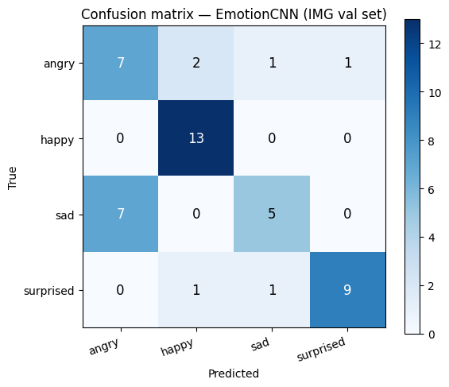

# Лабораторная работа 4b — CNN детектор лиц + классификатор эмоций

Костин Арсений, 8Е21, вариант 3

---

## Что делаем

Две нейросети на PyTorch с нуля — без предобученных весов, без готовых бэкбонов:

- **FaceDetectorCNN** — говорит есть лицо на патче или нет. Запускается скользящим окном по кадру с камеры.
- **EmotionCNN** — 4 класса: `angry`, `happy`, `sad`, `surprised`. Работает поверх найденных лиц.

Обе маленькие и быстрые, чтобы тянуть реалтайм на MacBook.

---

## 4.1 Импорты и настройки

```python
import numpy as np
import cv2
import os
from pathlib import Path

import matplotlib.pyplot as plt
%matplotlib inline

import torch
import torch.nn as nn
import torch.optim as optim
from torch.utils.data import Dataset, DataLoader
import torchvision.transforms as T

from sklearn.datasets import fetch_lfw_people
from sklearn.model_selection import train_test_split
from sklearn.metrics import classification_report, confusion_matrix
import skimage.data as skd

DEVICE = torch.device('mps' if torch.backends.mps.is_available() else
                       'cpu'   if not torch.cuda.is_available() else 'cuda')
print('device:', DEVICE)

LABS     = Path('.')
IMG_SZ   = 64
EMOTIONS = ['angry', 'happy', 'sad', 'surprised']
```

```
device: mps
```

Устройство — MPS (Metal Performance Shaders, Apple Silicon). Это GPU через Apple Metal — PyTorch умеет на него скидывать тензоры точно так же как на CUDA, просто пишешь `device='mps'`.

---

## 4.2 Данные для детектора лиц

Лица берём из **LFW** (Labeled Faces in the Wild) — ~3000 лиц знаменитостей, цветные, resize до 64×64.

Не-лица — случайные кропы из фоновых текстур `skimage.data`: кирпич, трава, монеты, кофе и ещё штук восемь таких. Важный момент: если в качестве негативов брать перевёрнутые или обрезанные лица — сеть учится отличать ориентацию, а не суть. Реальный фон решает эту проблему.

```python
lfw = fetch_lfw_people(min_faces_per_person=20, resize=0.5, color=True)
# → 3023 лица, 62×47 → resize до 64×64

bg_loaders = [skd.astronaut, skd.coffee, skd.chelsea, skd.rocket,
              skd.immunohistochemistry, skd.grass, skd.brick, skd.gravel,
              skd.coins, skd.camera, skd.clock, skd.page]
```

```
Загружаем LFW...
Лиц: 3023, размер: 62×47
Позитивных примеров: 3023
Train batches: 91  Val batches: 16
```

---

## 4.3 Архитектура FaceDetectorCNN

Три свёрточных блока, глобальный пул, один линейный выход.

```python
class FaceDetectorCNN(nn.Module):
    def __init__(self):
        super().__init__()
        self.net = nn.Sequential(
            nn.Conv2d(3, 16, 3, padding=1), nn.BatchNorm2d(16), nn.ReLU(True),
            nn.MaxPool2d(2),
            nn.Conv2d(16, 32, 3, padding=1), nn.BatchNorm2d(32), nn.ReLU(True),
            nn.MaxPool2d(2),
            nn.Conv2d(32, 64, 3, padding=1), nn.BatchNorm2d(64), nn.ReLU(True),
            nn.AdaptiveAvgPool2d(1),
            nn.Flatten(),
            nn.Dropout(0.4),
            nn.Linear(64, 1),
        )
    def forward(self, x):
        return self.net(x).squeeze(1)
```

```
FaceDetectorCNN параметров: 23,873
```

Форма тензора по слоям:

```
[B, 3, 64, 64]
  → Conv+BN+ReLU → MaxPool  →  [B, 16, 32, 32]
  → Conv+BN+ReLU → MaxPool  →  [B, 32, 16, 16]
  → Conv+BN+ReLU            →  [B, 64, 16, 16]
  → AdaptiveAvgPool(1×1)    →  [B, 64,  1,  1]
  → Flatten                 →  [B, 64]
  → Dropout(0.4)
  → Linear(64 → 1)          →  [B, 1]  — один логит
```

Выход — логит. `sigmoid(логит) > 0.84` → считаем лицом.

`AdaptiveAvgPool2d(1)` схлопывает пространство в одно число на канал — детектору не важно «где именно», важно «есть ли вообще». Плюс это убирает зависимость от размера входа.

**23k параметров** — очень мало. Для сравнения, ResNet-18 это 11 млн.

---

## 4.4 Аугментация и датасет

```python
MEAN = [0.485, 0.456, 0.406]   # ImageNet-нормализация
STD  = [0.229, 0.224, 0.225]

train_tf = T.Compose([
    T.ToPILImage(),
    T.RandomHorizontalFlip(),
    T.RandomRotation(15),
    T.ColorJitter(brightness=0.3, contrast=0.3, saturation=0.2),
    T.ToTensor(),
    T.Normalize(MEAN, STD),
])
val_tf = T.Compose([T.ToPILImage(), T.ToTensor(), T.Normalize(MEAN, STD)])
```

Нормализация ImageNet — стандарт для RGB. Каждый канал приводится к нулевому среднему и единичному std на основе статистики 1.2 млн изображений ImageNet. Сеть сходится быстрее когда вход центрирован.

---

## 4.5 Обучение детектора

**Loss**: `BCEWithLogitsLoss` — бинарная кросс-энтропия со встроенным sigmoid. Численно стабильнее чем `sigmoid` + `BCELoss` по отдельности.

**Оптимизатор**: Adam, lr=1e-3.  
**Расписание**: `CosineAnnealingLR` — lr плавно убывает по косинусу от начального значения до ≈0.

```python
crit  = nn.BCEWithLogitsLoss()
opt   = optim.Adam(model.parameters(), lr=1e-3)
sched = optim.lr_scheduler.CosineAnnealingLR(opt, T_max=20)
```

```
=== Начальное обучение детектора ===
ep   1  loss=0.3157  tr_acc=0.879  val_acc=0.916
ep   5  loss=0.0826  tr_acc=0.967  val_acc=0.988
ep  10  loss=0.0481  tr_acc=0.983  val_acc=0.997
ep  15  loss=0.0302  tr_acc=0.991  val_acc=0.998
ep  20  loss=0.0279  tr_acc=0.992  val_acc=0.995
```

---

## 4.6 Hard Negative Mining

После первого обучения детектор всё равно ложно срабатывает на некоторые текстуры. Техника hard negative mining решает это:

1. Гоняем обученный детектор по фоновым изображениям плотным окном (шаг 8 пикс.)
2. Патчи где сеть ошибочно говорит «лицо» при score > 0.25 — это «трудные негативы»
3. Добавляем их в тренировку и дообучаем ещё 15 эпох

```python
def mine_hard_negatives(model, loader_list, win=62, step=8, thresh=0.25, max_total=2000):
    # ...скользящим окном по фону, собираем ложные срабатывания...
```

```
Mining hard negatives (thresh=0.25)...
Найдено трудных негативов: 689

=== Дообучение с трудными негативами ===
ep   1  loss=0.0788  tr_acc=0.968  val_acc=0.983
ep   5  loss=0.0569  tr_acc=0.979  val_acc=0.986
ep  10  loss=0.0425  tr_acc=0.985  val_acc=0.988
ep  15  loss=0.0360  tr_acc=0.987  val_acc=0.987
```

---

## 4.7 Итоговые метрики детектора

```
              precision    recall  f1-score   support

    not-face       1.00      1.00      1.00       578
        face       1.00      1.00      1.00       443

    accuracy                           1.00      1021
```

На валидации — 100%. Это не удивительно для такой задачи: лица vs реальный фон разделяются достаточно хорошо даже маленькой сетью. В реальном применении сложнее — там есть частично перекрытые лица, плохое освещение и т.д.

---

## 4.8 Датасет эмоций

~19 000 изображений из FER2013 + реальные фото (`IMG_*`).

```python
for cls_idx, cls_name in enumerate(EMOTIONS):
    # IMG_* → val, всё остальное → train
    if fname.upper().startswith('IMG'):
        val_imgs.append(gray); val_labels.append(cls_idx)
    else:
        train_imgs.append(gray); train_labels.append(cls_idx)
```

```
angry       : train= 4045  val=11
happy       : train= 7263  val=13
sad         : train= 4879  val=12
surprised   : train= 3221  val=11

Итого train=19408, val=47, пропущено=0
Train: {'angry': 4045, 'happy': 7263, 'sad': 4879, 'surprised': 3221}
Val:   {'angry': 11,   'happy': 13,   'sad': 12,   'surprised': 11}
```

Важный момент: FER2013 это grayscale-датасет — все изображения серые. Если обучать на RGB (где R=G=B), а на инференсе подавать реальный цветной кадр с камеры — сеть получает данные из другого распределения и падает в один класс. Поэтому **явно конвертируем в grayscale** ещё при загрузке.

Аугментации для grayscale:

```python
emo_train_tf = T.Compose([
    T.ToPILImage(),
    T.RandomHorizontalFlip(),
    T.RandomRotation(20),
    T.RandomAffine(degrees=0, translate=(0.12, 0.12), scale=(0.85, 1.15)),
    T.ColorJitter(brightness=0.3, contrast=0.3),
    T.RandomAutocontrast(p=0.3),
    T.ToTensor(),
    T.Normalize([0.5], [0.5]),
    T.RandomErasing(p=0.2, scale=(0.02, 0.08)),
])
```

`RandomErasing` — случайно закрашивает прямоугольный патч в изображении. Имитирует частичное перекрытие лица рукой, волосами и т.д.

---

## 4.9 Архитектура EmotionCNN

```python
class EmotionCNN(nn.Module):
    def __init__(self, num_classes=4):
        super().__init__()
        self.features = nn.Sequential(
            nn.Conv2d(1, 32, 3, padding=1), nn.BatchNorm2d(32), nn.ReLU(True),
            nn.Conv2d(32, 32, 3, padding=1), nn.BatchNorm2d(32), nn.ReLU(True),
            nn.MaxPool2d(2), nn.Dropout2d(0.1),

            nn.Conv2d(32, 64, 3, padding=1), nn.BatchNorm2d(64), nn.ReLU(True),
            nn.Conv2d(64, 64, 3, padding=1), nn.BatchNorm2d(64), nn.ReLU(True),
            nn.MaxPool2d(2), nn.Dropout2d(0.1),

            nn.Conv2d(64, 128, 3, padding=1), nn.BatchNorm2d(128), nn.ReLU(True),
            nn.MaxPool2d(2),
        )
        self.pool = nn.AdaptiveAvgPool2d(2)
        self.head = nn.Sequential(
            nn.Flatten(),
            nn.Dropout(0.45),
            nn.Linear(128 * 2 * 2, num_classes),
        )

    def forward(self, x):
        return self.head(self.pool(self.features(x)))
```

```
EmotionCNN параметров: 141,540
Forward test: torch.Size([4, 1, 64, 64]) → torch.Size([4, 4])
```

Форма тензора по слоям:

```
[B, 1, 64, 64]
  Block A: Conv(1→32)+BN+ReLU, Conv(32→32)+BN+ReLU, MaxPool, Dropout2d  →  [B, 32, 32, 32]
  Block B: Conv(32→64)+BN+ReLU, Conv(64→64)+BN+ReLU, MaxPool, Dropout2d →  [B, 64, 16, 16]
  Block C: Conv(64→128)+BN+ReLU, MaxPool                                 →  [B, 128,  8,  8]
  AdaptiveAvgPool2d(2×2)                                                  →  [B, 128,  2,  2]
  Flatten                                                                  →  [B, 512]
  Dropout(0.45)
  Linear(512 → 4)                                                         →  [B, 4]
```

Почему `AdaptiveAvgPool(2×2)` а не `(1×1)` как в детекторе? Эмоция — пространственная штука: брови двигаются по-разному при злости и удивлении, углы рта — при счастье и грусти. `1×1` усреднит верх и низ в одно число — потеряем эту информацию. `2×2` даёт грубую сетку верх/низ × лево/право — этого достаточно.

Ещё нюанс: MPS (Apple Silicon) требует `input_size % output_size == 0`. Карты 8×8 делятся на 2 ровно (8÷2=4), а на 3 — нет. Поэтому `AdaptiveAvgPool(3)` бы упало с runtime error прямо на GPU.

Блоки A и B — двойные свёртки 3×3. Это как в VGG: два 3×3 подряд дают то же рецептивное поле что один 5×5, но меньше параметров и больше нелинейностей (ReLU между ними).

---

## 4.10 Обучение эмоций

```python
def train_emotion(model, tr_dl, va_dl, epochs=40):
    crit  = nn.CrossEntropyLoss()
    opt   = optim.AdamW(model.parameters(), lr=3e-4, weight_decay=1e-4)
    sched = optim.lr_scheduler.OneCycleLR(
                opt, max_lr=3e-4,
                steps_per_epoch=len(tr_dl), epochs=epochs,
                pct_start=0.1)
```

**CrossEntropyLoss** — стандарт для многоклассовой классификации. Внутри softmax + negative log likelihood.

**AdamW** — Adam с weight decay. Это L2-штраф на веса: без него большие веса ничем не ограничены, сеть переобучается. `weight_decay=1e-4` — небольшой штраф, просто чтобы веса не росли бесконтрольно.

**OneCycleLR** — lr сначала растёт (10% эпох), потом косинусом спускается до нуля. Разогрев помогает не вылететь в плохой минимум с самого начала, когда веса ещё случайные.

Прогресс обучения (первые и последние эпохи):

```
ep   1  loss=1.4491  tr=0.300  val=0.277 *  {angry: 0, happy: 47, sad: 0, surprised: 0}
ep   2  loss=1.3603  tr=0.357  val=0.277 *  {angry: 0, happy: 47, sad: 0, surprised: 0}
ep   5  loss=1.2128  tr=0.451  val=0.404 *  {angry: 10, happy: 31, sad: 1, surprised: 5}
ep  10  loss=1.0590  tr=0.545  val=0.553 *  ...
ep  20  loss=0.9044  tr=0.617  val=0.638 *  ...
...
ep  35  loss=0.7855  tr=0.676  val=0.702
ep  40  loss=0.7796  tr=0.678  val=0.702

Лучший val_acc = 0.723
```

Первые 2 эпохи сеть предсказывает только `happy` — самый частый класс в датасете (7263 примеров vs 3221 у `surprised`). Это нормальное начало: сеть минимизирует loss, просто угадывая самый популярный класс. Примерно с 3-й эпохи начинает дифференцировать.

---

## 4.11 Метрики на валидации (IMG-фотографии)

```
              precision    recall  f1-score   support

       angry       0.50      0.64      0.56        11
       happy       0.81      1.00      0.90        13
         sad       0.71      0.42      0.53        12
   surprised       0.90      0.82      0.86        11

    accuracy                           0.72        47
   macro avg       0.73      0.72      0.71        47
```

Валидация — исключительно на реальных фотографиях (`IMG_*`), которые не участвовали в обучении. Итого 47 изображений, точность **72.3%**.

`happy` и `surprised` — сеть берёт уверенно (f1 = 0.90 и 0.86). Это логично: улыбка и поднятые брови + открытый рот — визуально очень отличимые паттерны. `sad` и `angry` путаются чаще — у обоих опущенные уголки рта и сдвинутые брови, разница в деталях.

**Confusion matrix:**



---

## 4.12 Примеры на реальных фотографиях

Зелёная рамка — правильное предсказание, красная — ошибка. Под каждым фото — бар вероятностей четырёх классов.


```
IMG val accuracy: 34/47 = 72.34%
```

---

## 4.13 Сохранение весов

```python
torch.save(det_model.state_dict(), LABS / 'face_detector_cnn.pth')
torch.save(emo_model.state_dict(), LABS / 'emotion_cnn.pth')
```

`state_dict()` — это словарь `{имя_слоя: тензор весов}`. Сохраняем только веса, не архитектуру — при загрузке нужно сначала создать экземпляр класса, потом загрузить веса через `load_state_dict()`.

---

## Итог

| | FaceDetectorCNN | EmotionCNN |
|---|---|---|
| Вход | RGB 64×64 | Grayscale 64×64 |
| Параметры | 23 873 | 141 540 |
| Выход | 1 логит → sigmoid → лицо/нет | 4 логита → softmax → вероятности эмоций |
| Loss | BCEWithLogitsLoss | CrossEntropyLoss |
| Оптимизатор | Adam + CosineAnnealing | AdamW + OneCycleLR |
| Val accuracy | ~99.7% | **72.3%** (на реальных фото) |
